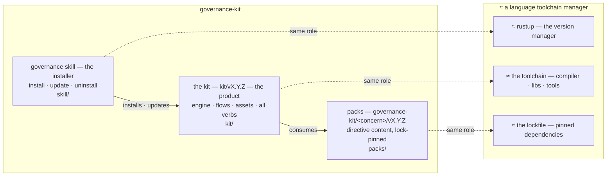

# Architecture

How `governance-kit` is organised, and how the pieces fit together.

## Layer map

The layer / responsibility model for `governance-kit` itself, carried as code so
it diffs as text and is gated against drift by the repo-local
`architecture-map-holds` directive. The **skill** installs the **kit**; the kit
**consumes** the **packs**; the arrows only ever point downward.

> The repo decides its versions: `.governance/install.yaml` pins the kit ·
> `.governance/packs.lock` pins the packs · the skill just honors the pin. In
> rustup terms: `install.yaml` ≈ `rust-toolchain.toml`, `packs.lock` ≈
> `Cargo.lock`.

### What the gate checks

`architecture-map-holds` (repo-local; `surface: repo-state`, runs on
`pre-commit` and in CI) fails the build when the picture drifts from the real
tree:

| Diagram claim | Real path | Mechanically gated |
|---|---|---|
| skill = installer, carries no kit code/version | `skill/` (only `SKILL.md` + `bootstrap.py`) | yes — no kit version string and nothing but those two files under `skill/` |
| kit = product | `kit/` | yes — path resolves and is named in the block |
| packs = lock-pinned content | `packs/` | yes — path resolves and is named in the block |
| repo pins kit + packs | `.governance/install.yaml` (`kit_version`), `.governance/packs.lock` | yes — both pins present and non-empty |
| skill → kit → packs, no upward edge | the arrows above | yes — the block carries both downward edges and no upward edge |

Every path the diagram names is tagged below so the check can confirm it still
resolves; renaming a layer without updating the map fails the gate. The rustup
analogy is prose, not a gated claim — it stays audit-only (issue #271's bucket
ladder), as does "the kit hardcodes no pack version" (docs and examples
legitimately mention pinned pack tags, so a mechanical form would only breed
waivers).

<!-- architecture-map-holds: each tagged token must (a) resolve to a real path
     and (b) appear verbatim in the mermaid block above. Renames fail the gate. -->
<!-- arch-map-path: skill/ -->
<!-- arch-map-path: kit/ -->
<!-- arch-map-path: packs/ -->

## Surfaces

`governance-kit` ships one agent-runtime skill plus the pack tree.
The skill is a self-contained directory with frontmatter
(`SKILL.md`), optional `assets/`, `references/`, and `evals/`.

- `governance/` — the unified lifecycle skill. Exposes four verb
  families (`init`, `uninstall`, `pack *`, `directive *`) that together
  own every mutation to the governance surface:
  `CONSTITUTION.md`, `.governance/`, hooks, the install manifest,
  and the AGENTS.md directive block. The per-verb flows are documented
  under `kit/references/`: `INIT_FLOW.md` (8 steps),
  `UNINSTALL_FLOW.md` (6 steps), `DIRECTIVE_AMEND_FLOW.md` (atomic-triple),
  and `PACK_VERBS.md` (community-pack lifecycle).

## Directive packs

Each pack is a directory. Three concern-scoped packs ship in-tree under
`packs/<concern>/`:

- `governance-kit/foundation` — `required-docs`, `internal-doc-links`,
  `repo-hygiene`, `managed-tree-integrity`.
- `governance-kit/commits` — `commit-message-format`, `no-orphan-todos`,
  `no-unjustified-suppressions`.
- `governance-kit/audit` — a trustworthy record of agent work: issue → receipt
  → commit traceability (`issue-templates`, `issues-tracked`,
  `receipt-per-issue`, `commit-issue-receipt-match`), session identity
  (`agent-session-identity`), and the tamper
  protection that keeps those records honest (`doc-integrity`,
  `toolchain-config-protection`).

The shared pack `lib/` (`packs.sh`, `install.sh`, `hooks.sh`, `packctl.py`,
`packverb.py`, `eval-lib.sh`) lives at `kit/assets/packs/lib/`.

Community packs live in their own repos and are consumed via
`governance pack add gh:<owner>/<repo>`. The advisory catalog at
`kit/assets/catalog.community.json` is the discoverability layer
for `governance pack search`; `governance pack add` works against any
GitHub ref whether or not it is in the catalog.

Every pack has:

- `pack.yaml` — pack identity and presets (`minimal`, `standard`, `strict`).
- `directives/<directive-id>/` — self-contained directive folder:
  - `directive.yaml` — `category`, `recommended`, `summary`, `surface`, `hook`.
  - `check.sh` — the executable test, sourcing `lib.sh`.
  - `constitution.md` — the Directive subsection copied into
    the target repo's `CONSTITUTION.md`.
  - `evals/test.sh` — pass/fail fixtures exercised by
    `scripts/test-packs.sh`.
  - Optional siblings: `install-assets/` (seed files), `hooks/*.sh`
    (directive-owned hook helpers), `runtimes/*.sh` (directive-local helpers).

## Directive lifecycle

1. Author writes `directives/<id>/` folder and registers it in the pack's
   `pack.yaml` preset.
2. `scripts/test-packs.sh` validates the pack structure, exercises
   every eval, and installs the bundled packs' `standard` preset into a
   disposable repo to confirm the bootstrap contract still holds.
3. `governance init` copies the directive folder into
   `.governance/packs/<owner>/<name>/directives/<id>/` in the target repo, records
   the install receipt in `.governance/install.yaml`, and pins each pack in
   `.governance/packs.lock`.
4. Hook generator builds `.githooks/pre-commit`, `.githooks/commit-msg`,
   `.githooks/prepare-commit-msg` from the installed manifest. Each
   dispatcher carries an ownership marker so `governance uninstall` can
   identify and remove it safely.
5. On commit, `.governance/run.sh` discovers every installed directive
   and runs `check.sh` against the repo state.

## Invariants

- Directive folders are self-contained. Relocating a directive is one `git mv`.
- The hook generator reads `directive.yaml` at install time — it does not
  import any pack-wide registry.
- `always_install: true` is reserved to the bundled `governance-kit/*` packs.
- Generated files carry ownership markers; `governance uninstall` is
  allowed to remove only files it can identify as its own.
- The fresh-repo contract in `scripts/test-packs.sh` proves that a
  new repo bootstrapped with the bundled packs' `standard` preset runs
  green end-to-end.
