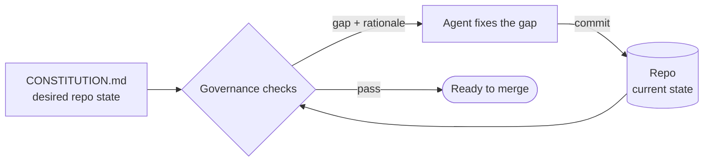
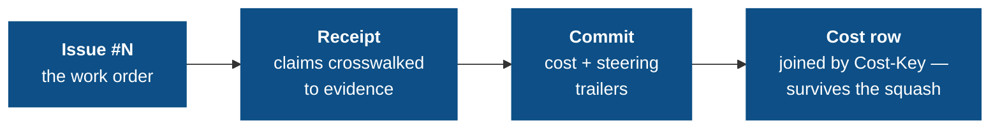
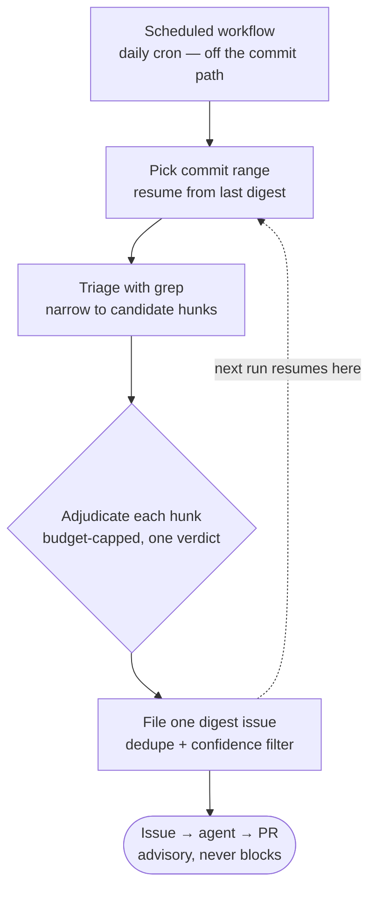
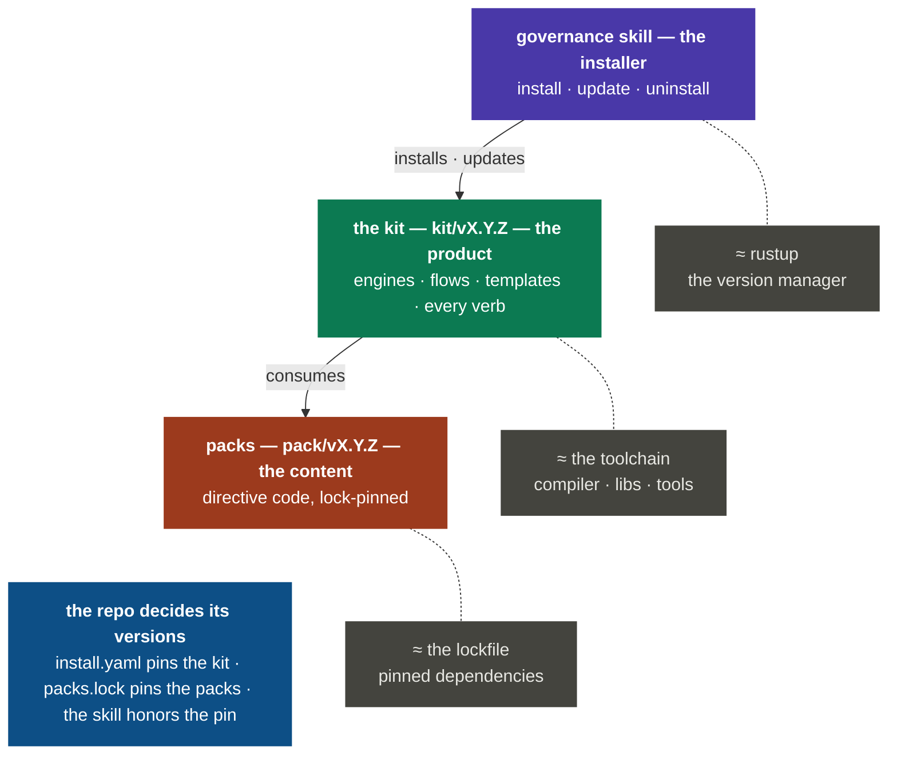

<div align="center">

<picture>
  <source media="(prefers-color-scheme: dark)" srcset="docs/assets/banner-dark.png">
  
</picture>

<p align="center">The governance layer for AI coding agents</p>

</div>

<p align="center"><strong>rules with tests · enforced on every commit · audit trail for every agent change · six bundled packs · MIT</strong></p>

<p align="center">
  <a href="https://github.com/Duaility/governance-kit/actions/workflows/governance.yml"></a>
  <a href="https://github.com/Duaility/governance-kit/actions/workflows/dogfood-smoke.yml"></a>
  <a href="https://github.com/Duaility/governance-kit/tags"></a>
  <a href="https://agentskills.io"></a>
  <a href="LICENSE"></a>
</p>

<p align="center">
  <a href="#get-started-60-seconds">Install</a> ·
  <a href="#why">Why</a> ·
  <a href="#proof--this-repo-governs-itself">Proof</a> ·
  <a href="#whats-bundled">Packs</a> ·
  <a href="#documentation">Docs</a> ·
  <a href="AGENTS.md">Contributing</a>
</p>

<p align="center"><sub>
  <b>AI agents:</b> start at <a href="AGENTS.md"><code>AGENTS.md</code></a> — the rules you must satisfy live in <a href="CONSTITUTION.md"><code>CONSTITUTION.md</code></a>.
</sub></p>

---

When an AI agent commits to your repo, it reads what's there and extends it — including the patterns that shouldn't be there. Across enough sessions, branches, and handoffs, your repo drifts: docs that contradict code, rules that live only in a closed chat window, the next agent inheriting a mess the previous one left. More instructions in the prompt don't fix this. The session ends, the context vanishes, and the next agent starts from whatever the repo looks like now.

OpenAI described this failure mode — and a way out — in their [harness engineering](https://openai.com/index/harness-engineering/) post, written while running an agent-first codebase at scale. The key insight: coherence comes from a *harness*, not better prompts. Rules that carry their own executable tests survive session boundaries. A failing check that surfaces the rule's rationale at the moment of violation reaches the next agent without a human relay. Humans steer; agents execute; the harness keeps the gap from growing.

Governance Kit packages that stance as an installable kit — and adds one layer. Rules live in **packs**: versioned, composable bundles you pin per repo, share across teams, or author locally to fit your stack. Every agent-authored commit leaves a git-native trail: issue → receipt → token cost → steering tally. The kit installs into [Claude Code](https://docs.anthropic.com/en/docs/claude-code), [Codex](https://github.com/openai/codex), Cursor, OpenCode, and 40+ agent runtimes via [`npx skills`](https://github.com/vercel-labs/skills).

- **Constitution** — `CONSTITUTION.md` declares the state your repo must satisfy; every directive ships with its `check.sh`, so the rule and its test evolve as one commit
- **Packs** — versioned directive bundles you compose, pin, and swap; six are bundled, and you can author repo-local packs to capture rules specific to your stack
- **Audit chain** — every agent-authored change links an issue, a receipt, a token cost, and a steering tally — all git-native, all checkable
- **Sweep lane** — LLM-adjudicated architectural rules that grep can't reach, running off the commit path so a false positive never breaks a gate

<details>
<summary><b>How each design choice maps to a named failure mode</b></summary>

| The agent-first failure mode | The design answer |
|---|---|
| Monolithic instruction files "rot instantly" — a single blob can't be mechanically checked, "so drift is inevitable" | A constitution where **every rule ships its executable test**. Doc freshness, link integrity, and record tampering are themselves directives — the rules can't decay silently. |
| Agents "replicate patterns that already exist in the repository — even uneven or suboptimal ones" | **Enforce invariants, not implementations.** Directives describe state; hooks + CI re-evaluate every one on every commit. The [sweep lane](#the-sweep-lane) runs the scan-for-deviations, file-targeted-issues garbage-collection loop. |
| Knowledge in chat threads and people's heads is "not accessible to the system" | **Git-native ledgers.** Rationale, evolution log, receipts, steering rows — every rule, exception, and correction lands in the repo, readable by the next agent run. |
| "Our bottleneck became human QA capacity" | **You review receipts, not diffs.** Each issue's receipt crosswalks claims to changes and verification, with a token price tag and a steering tally attached. |
| Context is scarce — "a giant instruction file crowds out the task" | **Progressive disclosure, enforced.** A failing check injects one directive's id + rationale at exactly the moment it's violated — not a 500-line prompt on every turn. |

</details>

## How it works (30 seconds)

Governance Kit treats governance as repo state and reconciles it on every commit:



- **A directive is an invariant, not a step** — rule, rationale, test, and log entry land as one commit and can't silently diverge
- **A failed check names the gap and the why** — an agent reading the rationale generalizes to cases the author never encoded
- **You read ledgers, not transcripts** — receipts and the evolution log are the record of what your agent fleet shipped

One line: **describe the state, continuously check reality, and let agents reconcile the difference.**

## Get started (60 seconds)

```sh
# 1 — install the skill into every skills-compatible agent on your machine
npx skills add Duaility/governance-kit

# 2 — in a fresh repo, ask your agent to bootstrap
claude
> governance init      # writes CONSTITUTION.md, .governance/, a pre-commit hook, the bundled packs

# 3 — watch the gate fire
git commit -m "stuff"
```

```
[FAIL] commit-message-format — pending commit — 'stuff' does not match
       Conventional Commits with an issue suffix (<type>(scope)?: <subject> (#123))
```

The agent reads the directive id + rationale and self-corrects on the next attempt.

What you installed is a thin shim — two files. The kit itself (rules, packs, templates, every other verb) is fetched from the released `kit/vX.Y.Z` tag and pinned per repo. See [Lifecycle](#lifecycle).

## Proof — this repo governs itself

- **21 directives gate every commit here** — the same packs `governance init` installs, plus a repo-local pack; two more sweep-lane rules adjudicate merged commits off the commit path
- **The committed `.governance/` tree is an honest customer of the last release** — pinned at real published tags, moved only by the real `pack update` verb, so every release exercises the update path
- **A CI smoke lane runs HEAD's directives against a throwaway copy of this repo** — a broken directive surfaces in its own PR, before it ships

Reproduce: clone this repo and run `bash .governance/run.sh`. The two-lane dogfood setup: [AGENTS.md](AGENTS.md).

## Agent compatibility

| Runtime | `npx skills add` | Notes |
|---|:---:|---|
| Claude Code | ✅ | symlinked into `~/.claude/skills/` |
| Codex | ✅ | symlinked into `~/.codex/skills/` |
| Cursor | ✅ | symlinked into `~/.cursor/skills/` |
| OpenCode | ✅ | |
| 40+ other runtimes | ✅ | anything that reads the [Agent Skills](https://agentskills.io) format |

The skill itself is a two-file shim; every verb executes from the kit version the target repo pins — so every runtime drives identical behavior, and updating the kit never requires reinstalling the skill.

## When to use · When to skip

**Great fit if you…**

- run agent-heavy teams where the rules must survive handoffs across branches, sessions, and agents
- want every agent-authored change to carry a price tag and a steering record
- want rules, their tests, and their history to evolve as one reviewable commit

**Skip it if you…**

- are spec-driving one feature at a time — that's [spec-kit](https://github.com/github/spec-kit); Governance Kit is the layer above
- only want hook execution — pre-commit / husky already do that, and every `check.sh` lifts into them directly ([NATIVE_TESTS.md](kit/references/NATIVE_TESTS.md))
- write all code by hand, solo, and don't need an audit trail

<details>
<summary><b>Integrations — run the checks from the toolchain you already have</b></summary>

`governance init` installs only the universal bash runner — zero dependencies. Native wrappers are an additive opt-in ([NATIVE_TESTS.md](kit/references/NATIVE_TESTS.md)):

| Your setup | Hook in with |
|---|---|
| Bare git | `governance init` wires the hook dispatchers for you |
| CI | the seeded governance workflow re-runs every directive on every PR |
| pytest | a test module that shells out to each `check.sh` — violations appear in the normal test report |
| jest / vitest · go test | same pattern, per-framework snippets in the doc |
| husky · pre-commit.com · lefthook | call `bash .governance/run.sh` from the hook they manage |

</details>

## What's bundled

Six concern packs ship in-tree and install with `governance init` at your chosen preset (`minimal` / `standard` / `strict`):

| Pack | Covers | Preset |
|---|---|---|
| `governance-kit/foundation` | Required docs, kit-version sync, repo hygiene | minimal–standard |
| `governance-kit/security` | Secrets hygiene, workflow permissions, pinned actions | minimal |
| `governance-kit/docs` | Internal link integrity, doc freshness | minimal–standard |
| `governance-kit/commits` | Conventional Commits + issue suffix, TODO and suppression discipline | standard–strict |
| `governance-kit/audit` | The agent audit chain — receipts, cost, steering, record integrity | standard |
| `governance-kit/architecture` | Sweep-lane architectural rules, LLM-adjudicated | strict (opt-in) |

Full catalog: [DIRECTIVES_CATALOG.md](kit/references/DIRECTIVES_CATALOG.md).

<details>
<summary><b>Every directive, with presets</b></summary>

### General-purpose directives

| Pack | Directive | What it enforces | Preset |
|---|---|---|---|
| `foundation` | `required-docs` | `README.md`, `LICENSE`, `SECURITY.md`, `ARCHITECTURE.md` exist with non-empty bodies. | minimal |
| `foundation` | `kit-version-sync` | The single kit-version pin agrees with every managed-file stamp. | standard |
| `foundation` | `repo-hygiene` | No merge markers, oversized files, build artefacts, or debug statements. | minimal |
| `security` | `secrets-hygiene` | No high-confidence secret patterns (AWS keys, GitHub tokens, Stripe live keys, …) in tracked files; `.env` gitignored. | minimal |
| `security` | `token-permissions` | GitHub Actions workflows declare a least-privilege `permissions:` block. | minimal |
| `security` | `pinned-dependencies` | Third-party actions are pinned to a full commit SHA. | minimal |
| `docs` | `internal-doc-links` | Internal markdown links resolve; opt-in, every doc stays reachable from a root. | minimal |
| `docs` | `doc-freshness` | Opted-in docs carry an in-window `last-verified` date marker. | standard |
| `commits` | `commit-message-format` | Conventional Commits with an issue suffix (`<type>(scope)?: <subject> (#N)`). | standard |
| `commits` | `no-orphan-todos` | Every `TODO` / `FIXME` references an issue. | strict |
| `commits` | `no-unjustified-suppressions` | Every lint / type-checker suppression (`@ts-ignore`, `# noqa`, …) references an issue. | strict |

### The audit chain

| Pack | Directive | What it enforces | Preset |
|---|---|---|---|
| `audit` | `issue-templates` | `.github/ISSUE_TEMPLATE/` carries `config.yml` (blank issues off), `proposal.yml`, `bug.yml` with the required handoff fields. | standard |
| `audit` | `issues-tracked` | `QUALITY.md` exists at repo root with `## Open` and `## Resolved` sections. | standard |
| `audit` | `receipt-per-issue` | Every `receipts/*.md` has a unique `issue-<N>` filename token, the four required sections, and each `- [x]` checklist item crosswalks into `## What changed` or `## Verification`. | standard |
| `audit` | `commit-issue-receipt-match` | Every non-merge commit's issue anchor (`(#N)` or `Issue: #N`) matches an `issue-<N>` token on a touched receipt. | standard |
| `audit` | `agent-token-accounting` | Every commit carries token + cost trailers and a matching cost row in the issue's receipt, keyed by `Cost-Key`. | standard |
| `audit` | `agent-steering-accounting` | Every commit stamps `Steer-Count` / `Steer-Types` / `Steer-Tiers` and appends steering rows to the issue's receipt. **`always_install: true`** — records human correction text verbatim; redact via the directive's classifier hook rather than skipping it. | standard |
| `audit` | `doc-integrity` | **`always_install: true`** — system-of-record documents are tamper-proof: receipts freeze once on the trunk, frozen sections (`QUALITY.md` Resolved, the Evolution Log) keep their baseline lines verbatim. Branch-authored content stays editable until it merges. | standard |
| `audit` | `toolchain-config-protection` | A commit changing lint / format / type-check / CI / hook config carries a `governance: allow-toolchain-config <reason>` body line. | standard |

### Sweep-lane directives

| Pack | Directive | What it enforces | Preset |
|---|---|---|---|
| `architecture` | `no-legacy-fallbacks` | No backward-compat shims or legacy fallback paths in agent-authored changes. | strict |
| `architecture` | `no-path-bifurcation` | No bifurcated code paths — unify dual dispatch and local-vs-remote special-casing. | strict |

</details>

<details>
<summary><b>Anatomy of a directive</b></summary>

Every directive is a self-contained folder — one `git mv` relocates the whole thing:

```
doc-freshness/
├── directive.yaml    # category, summary, surface, hook
├── check.sh          # the executable test (pre-commit + CI)
├── constitution.md   # Directive / Rationale / Enforced by / Exceptions
└── evals/test.sh     # pass + fail fixtures
```

The `constitution.md` carries the *why*:

```markdown
### doc-freshness

- **Directive**: Docs opted into `.governance/conf/doc-freshness.conf` carry a
  `<!-- last-verified: YYYY-MM-DD -->` marker dated within the last 90 days.
- **Rationale**: Critical runbooks and onboarding docs decay. A periodic
  "someone re-read this" checkpoint keeps them honest — if the deadline
  passes, either bump the date or fix the doc.
- **Enforced by**: `.governance/packs/governance-kit/docs/directives/doc-freshness/check.sh`
- **Exceptions**: Remove a doc from `.governance/conf/doc-freshness.conf` to opt it out.
```

A bare hook checks the date format. The rationale tells the next agent — and the next human — what the date is *for*.

Directives that need more carry optional siblings — `lib/` (shared bash/Python), `hooks/` (side-effect scripts wired into the dispatcher), `runtimes/` (per-runtime helpers), `install-assets/` (templates seeded at bootstrap).

**Composition**: directives are invariants on state, not steps in a procedure. There is no `depends_on:`, no graph engine — `.governance/run.sh` re-evaluates every check on every firing, and cascades fall out of re-evaluation: fix what's currently violating, re-run, the next gate fires, converge.

</details>

## The audit chain

If you're trusting agents to ship code, you need to see what they were told, what they did, what it cost, and how much you had to steer. Four git-native artifacts compose into a chain, and breaking any link fails the next push:



- **Directive provenance** — every `CONSTITUTION.md` line is git-blameable to the commit and check that introduced it; the Evolution Log summarizes every amendment
- **Receipts** — one per issue; every checked box must crosswalk into `## What changed` or `## Verification`, so boxes can't flip silently. The reviewer reads the receipt, not the diff
- **Token cost** — every commit carries cost trailers and a matching row in the issue's receipt; every change has a price tag
- **Steering** — every commit tallies the human interrupts and redirects it needed; see at a glance which commits ran on autopilot

Ships in the `governance-kit/audit` pack, `standard` preset.

## The sweep lane

Some rules are about *intent* — "no legacy fallbacks", "don't bifurcate the code path" — the kind a `git grep` fundamentally cannot reach. Those run off the commit path entirely: a scheduled workflow sweeps the day's commits, triages with a cheap grep, adjudicates candidate hunks with a budget-capped LLM judge, and files **one digest issue**. Findings re-enter as issue → agent → PR — a false positive can never break a gate, because there is no gate.



The judge stays advisory until its digest precision earns a promotion, and directives pin a model *tier*, not a model id. Opt-in via the `strict` preset. Full walkthrough: [SWEEP_FLOW.md](kit/references/SWEEP_FLOW.md).

## Lifecycle

```
governance init                                        # bootstrap a repo
governance kit update [--with-packs|--dry-run|--force] # re-sync runtime files to a new kit version
governance pack {list,search,add,update,remove,create} # pack lifecycle (community + repo-local)
governance directive {add,modify,remove} [--pack …]    # atomic directive amendments
governance reset {--directive <id>|--pack <id>|--all}  # restore drifted directives to the pinned version
governance uninstall [--dry-run|--soft|--hard]         # tear-down
```

The mental model — an installer, a product, its content. Like a language toolchain manager:



The two version axes are independent (the Helm `Chart.version` vs `appVersion` model — [VERSIONING.md](kit/references/VERSIONING.md)): the **kit** is the framework (runtime, hook generators, engines, schemas; tagged `kit/vX.Y.Z`), **packs** are the directive content (each on its own `pack.yaml` version). `.governance/packs.lock` pins what runs; the check code is vendored into `.governance/packs/` and committed, so a pack bump shows the real `check.sh` diff, not just a SHA.

```sh
# the kit
npx skills add Duaility/governance-kit -g              # all agents (-a claude-code for one; bare = project-scoped)
governance kit update [--with-packs]                   # re-sync the runtime files init seeded; prompts per file
governance uninstall --dry-run                         # preview; --soft keeps pack-seeded docs, --hard removes all

# packs
governance pack add gh:acme/soc2-pack@v1.2.0           # install a community pack — pin a tag, not a branch
governance pack update [<pack-id>]                     # re-pin + re-vendor; shows the check-code diff first
governance pack create <name>                          # scaffold a repo-local pack
```

- **`kit update` and `pack update` are disjoint** — framework runtime vs directive content; managed files carry a `# governance-kit:managed` marker that flags them safe to regenerate
- **`uninstall` only deletes what it recognizes as kit-owned** — manifest entries + markers; never your content, unmarked hooks, or uncommitted changes
- **Community packs** live in their own repos ([PACK_AUTHORING.md](kit/references/PACK_AUTHORING.md)); discovery reads the advisory catalog at [catalog.community.json](kit/assets/catalog.community.json) — currently empty, PRs welcome

> [!IMPORTANT]
> Don't hand-edit `CONSTITUTION.md` or files under `.governance/`. The `directive {add,modify,remove}` and `reset` verbs keep the check, the rationale, and the evolution log in lockstep — hand-edits drift the constitution out of sync with the tests.

<details>
<summary><b>Manual install (no <code>npx</code>, or for hacking on the kit)</b></summary>

Clone and symlink the skill folder into each runtime you use:

```sh
git clone https://github.com/Duaility/governance-kit
cd governance-kit
ln -s "$(pwd)/skill" ~/.claude/skills/governance   # Claude Code
ln -s "$(pwd)/skill" ~/.codex/skills/governance    # Codex
```

Edits in the clone flow to every linked runtime live — handy when contributing to Governance Kit itself.

</details>

## Documentation

| Start here | Go deeper |
|---|---|
| [Philosophy](kit/references/PHILOSOPHY.md) — rules over prompts, receipts over plans | [Versioning](kit/references/VERSIONING.md) — two semver axes, tag scheme |
| [Directives catalog](kit/references/DIRECTIVES_CATALOG.md) — every ready-made check | [Release flow](kit/references/RELEASE_FLOW.md) — how releases are cut |
| [Pack authoring](kit/references/PACK_AUTHORING.md) — write your own pack | [Sweep flow](kit/references/SWEEP_FLOW.md) — the LLM-judge lane |
| [Native tests](kit/references/NATIVE_TESTS.md) — port checks to pytest / jest / husky | [Directive amend flow](kit/references/DIRECTIVE_AMEND_FLOW.md) — how amendments land |
| [AGENTS.md](AGENTS.md) — working in this repo | [Install schema](kit/references/INSTALL_SCHEMA.md) · [lock schema](kit/references/LOCK_SCHEMA.md) |

## Compared to

|  | Governs | Blocks a bad commit | Rationale travels with the rule | Agent audit trail |
|---|---|:---:|:---:|:---:|
| **Governance Kit** | Repo state — docs, security, commits, receipts, architecture | Yes | Yes — constitution + evolution log | Yes — issue → receipt → commit → cost |
| pre-commit · husky · lefthook | Hook execution | Yes | No | No |
| [spec-kit](https://github.com/github/spec-kit) | One feature's spec → implementation | No | Per-spec | No |
| Agent instruction files alone | What agents are told, not what they do | No | No | No |

> **Complements, not competitors.** If you're spec-driving features for an agent to implement, spec-kit is the right fit — Governance Kit is the layer above, keeping the rules your agent must satisfy on every commit from drifting out of sync with the code, the tests, or each other. And every `check.sh` is plain bash: drop them into pre-commit or husky directly if you only want the enforcement half ([NATIVE_TESTS.md](kit/references/NATIVE_TESTS.md)).

## Contributing

```sh
git clone https://github.com/Duaility/governance-kit && cd governance-kit
./scripts/enable-governance.sh   # one-time per clone — sets core.hooksPath=.githooks
bash .governance/run.sh          # run the full directive suite
```

Repo layout, adding directives, and the dogfooding setup: [AGENTS.md](AGENTS.md).

<details>
<summary><b>Releasing (maintainers)</b></summary>

Version lines are written **only** by [`scripts/release.sh`](scripts/release.sh) in `chore(release)` commits — any out-of-band edit to a version field is drift the `kit-version-sync` directive catches. Cut the **kit** axis for framework changes, a **pack** axis for directive-content changes; pick the semver level from the [policy table](kit/references/VERSIONING.md#semver-policy).

```sh
bash scripts/release.sh <kit|PACK> <X.Y.Z> --dry-run   # preview — bump, re-stamps, tag, CHANGELOG
bash scripts/release.sh security 0.2.0                 # cut a pack release
bash scripts/release.sh kit 0.6.0 --push               # cut a kit release and push branch + tag
```

A real run preflights (`main`, clean tree, semver-greater target, green suite), regenerates the CHANGELOG section, commits through the hook path, and creates the prefixed annotated tag. Pushing the tag triggers [release.yml](.github/workflows/release.yml), which lifts the CHANGELOG section into a GitHub Release. Full procedure: [RELEASE_FLOW.md](kit/references/RELEASE_FLOW.md).

</details>

## Community

- **[Issues](https://github.com/Duaility/governance-kit/issues)** — bugs and proposals; blank issues are off, and the templates carry the agent-handoff fields the audit chain expects
- **[Community pack catalog](kit/assets/catalog.community.json)** — the advisory index `governance pack search` reads; currently empty, PRs welcome

## License

MIT — see [LICENSE](LICENSE).
