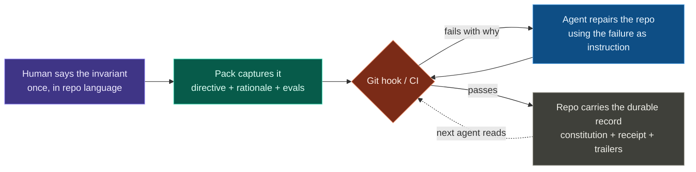
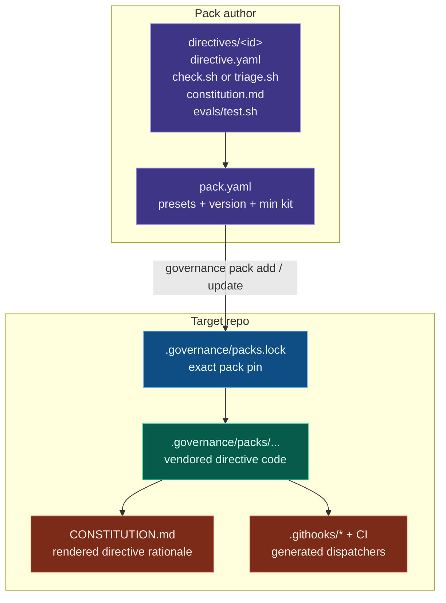
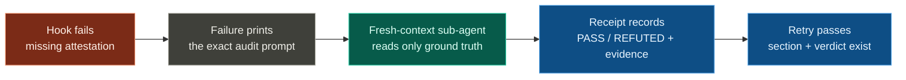
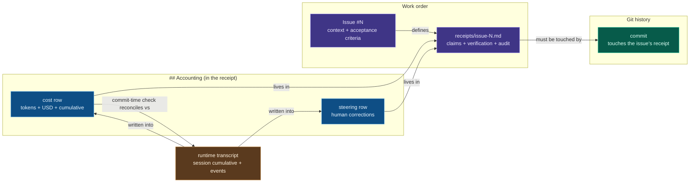
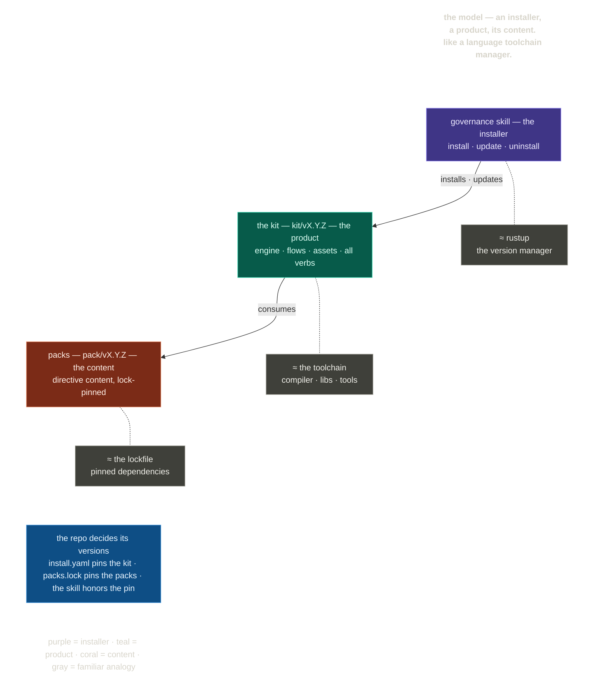

<div align="center">

<picture>
  <source media="(prefers-color-scheme: dark)" srcset="docs/assets/banner-dark.png">
  
</picture>

<p align="center">Give every coding agent the same repo memory</p>

</div>

<p align="center"><strong>stop re-teaching agents · prevent unwanted rewrites · expose token spend · keep durable rules in git · MIT</strong></p>

<p align="center">
  <a href="https://github.com/Duaility/governance-kit/actions/workflows/governance.yml"></a>
  <a href="https://github.com/Duaility/governance-kit/tags"></a>
  <a href="https://agentskills.io"></a>
  <a href="LICENSE"></a>
</p>

<p align="center">
  <a href="#get-started-60-seconds">Install</a> ·
  <a href="#the-core-idea">Idea</a> ·
  <a href="#the-invariant-ladder">Invariants</a> ·
  <a href="#packs-make-rules-portable">Packs</a> ·
  <a href="#proof--this-repo-governs-itself">Proof</a> ·
  <a href="#documentation">Docs</a> ·
  <a href="AGENTS.md">Contributing</a>
</p>

<p align="center"><sub>
  <b>AI agents:</b> start at <a href="AGENTS.md"><code>AGENTS.md</code></a> — the rules you must satisfy live in <a href="CONSTITUTION.md"><code>CONSTITUTION.md</code></a>.
</sub></p>

---

## The core idea

If you use coding agents heavily, you know the pattern.

You ask Claude Code to make one small change. It touches six files, invents a new pattern, and the feature starts drifting. Tomorrow you ask Codex to continue the same branch, and it has no memory of the correction you gave Claude. Another agent rewrites a working module instead of making the surgical edit. A third spends real money exploring the wrong direction, but the only record is buried in a transcript you will never read again.

Governance kit turns those repeated corrections into **repo-native invariants**. The rules stop living in your head, your prompt, or one agent's context window. They live in git, next to the code, with executable checks that run on every commit.

Examples of rules developers need once agents do real work:

- define the slice before coding: goal, non-goals, allowed files, and checks
- keep the diff inside that slice unless the human approves the expanded surface
- block "small fixes" that become rewrites or duplicate abstractions
- make receipts say what changed, what was tested, and what risk remains
- audit boundary drift before debating code quality
- record token cost and human steering in git, not in a chat transcript

Prompts steer one session. Governance kit makes the repo carry the rule, the rationale, the executable check, and the audit trail. When the next agent resumes the work, it does not need the old transcript to know what matters; the repo gives it a failing check with the reason attached.



This is the [harness-engineering](https://openai.com/index/harness-engineering/) move: coherence comes from executable rails around the agent, not from ever-larger instruction blobs. Governance kit packages that stance for ordinary repositories, then adds versioned packs and git-native receipts so developers can share, pin, review, and evolve those rails.

Governance kit installs into [Claude Code](https://docs.anthropic.com/en/docs/claude-code), [Codex](https://github.com/openai/codex), Cursor, OpenCode, and other Agent Skills-compatible runtimes via [`npx skills`](https://github.com/vercel-labs/skills). The installed skill is only the thin entry point; the repo pins the kit and pack versions that actually run, so different agents in the same project hit the same rules.

## The invariant ladder

The key power is the depth of invariants you can express. Start with deterministic checks; escalate only when the rule genuinely needs context or judgment.

| Depth | What the user can say | How it runs |
|---|---|---|
| **Repo state** | "Every repo needs a README, license, security contact, and architecture note." "Do not commit build output or merge markers." | Cheap `check.sh` over the tree, run locally and in CI. |
| **Change set** | "A CI config change needs a reason in the commit." "A receipt for issue #42 must mention the files this PR actually changed." | Diff-aware hooks plus CI's merge-base walk. |
| **Ledger** | "For each agent-authored commit, show the issue, receipt, token cost, and human steering count." | Git trailers and receipt accounting rows, cross-checked by directives. |
| **Sub-agent attestation** | "Before merging a cross-layer refactor, have a fresh reader compare the diff to the architecture map." "Before accepting a receipt, have a fresh reader verify it matches the issue and diff." | Hook fails with a fresh-context sub-agent prompt; agent records a PASS/REFUTED section; hook verifies presence. |

That range matters. Most painful agent failures are not "forgot to run formatter." They are semantic: the agent split a path you wanted unified, moved shared logic into the wrong layer, claimed verification that does not match the diff, preserved a legacy branch after being asked to remove it, or burned tokens without leaving a usable trail. Governance kit gives each kind of rule an enforcement surface that matches its nature.

## What developers get

- **Less repeated steering** - encode "do not rewrite this," "keep this path unified," or "update the receipt with evidence" once, then let hooks and CI repeat it for every agent.
- **Shared behavior across agents** - Claude Code, Codex, Cursor, OpenCode, and humans all hit the same repo-pinned checks instead of inheriting different chat histories.
- **Cost transparency** - token spend and human steering can be recorded in the issue receipt, so expensive turns and repeated corrections become visible review data.
- **Executable constitution** - `CONSTITUTION.md` is readable policy, but every directive has executable enforcement beside it.
- **Agent-readable failures** - violations name the rule, the specific gap, and the rationale, so the next agent turn has useful context.
- **Custom governance packs** - teams can publish `acme/backend`, `acme/soc2`, or `duaility/governance-kit` packs and pin them per repo.

## Packs make rules portable

A pack is a versioned bundle of invariants. Each directive is a self-contained folder: metadata, executable check, constitution text, defaults, helper code, and pass/fail evals. Install a pack, and the target repo receives the rule, the rationale, the hook wiring, and the lockfile pin together.



Bundled packs cover foundation, docs, commits, and the agent audit chain. Custom packs are where the project becomes specific to your organization: architecture boundaries, service ownership, migration rules, compliance evidence, review rituals, or repeated "please never do that again" corrections.

Examples of rules that fit naturally as packs:

| Pack idea | Invariants it could carry |
|---|---|
| `acme/platform` | "No service reaches across the platform boundary." "Generated clients are refreshed with API schema changes." |
| `acme/security` | "Auth changes update threat-model evidence." "Privileged workflows explain permissions changes." |
| `acme/migration-2026` | "No new writes hit the legacy store." "Fallback paths are deleted, not hidden behind flags." |
| `acme/mobile` | "User-visible copy changes update localization receipts." "Feature-flag removals clean up both client and server paths." |

## Sub-agent attestations: semantic checks without pretending bash is smart

Some invariants need a judgment against ground truth. A shell script can check that a receipt has a `## Audit` section; it cannot honestly decide whether the receipt describes the diff. Governance kit handles that by making the missing section itself the remediation instruction.



The hook does not spawn the sub-agent and does not pretend to prove the verdict is true. It proves the independent audit was recorded. This is deliberately honest: deterministic checks stay deterministic; semantic checks record accountable judgment.

## Get started (60 seconds)

```sh
# 1 — install the skill into every skills-compatible agent on your machine
npx skills add Duaility/governance-kit

# 2 — in a fresh repo, ask your agent to bootstrap
claude
> governance init      # writes CONSTITUTION.md, .governance/, a pre-commit hook, the bundled packs

# 3 — watch the gate fire
git commit -m "stuff"
```

```
[FAIL] commit-message-format — pending commit — 'stuff' does not match
       Conventional Commits with an issue suffix (<type>(scope)?: <subject> (#123))
```

The agent reads the directive id + rationale and self-corrects on the next attempt. The rule is no longer a reminder you have to paste into every new session.

What you installed is a thin shim — two files. The kit itself (rules, packs, templates, every other verb) is fetched from the released `kit/vX.Y.Z` tag and pinned per repo. See [Lifecycle](#lifecycle).

## Proof — this repo governs itself

- **17 synchronous directive checks gate this repo** — the same packs `governance init` installs, plus a repo-local pack
- **It dogfoods semantic invariants** — `ARCHITECTURE.md` is itself gated by an architecture-map directive, and every PR receipt now carries fresh-context attestations such as `## Audit` and `## Layer boundaries`
- **The committed `.governance/` tree is an honest customer of the last release** — pinned at real published tags, moved only by the real `pack update` / `update` verb, so every release exercises the update path
- **Its integrity is self-enforced** — the `managed-tree-integrity` directive recomputes the content digests recorded at install time on every commit, so a hand-edit to any vendored check or runtime file fails the gate, offline

Reproduce: clone this repo and run `bash .governance/run.sh`. The dogfood setup: [AGENTS.md](AGENTS.md).

## Agent compatibility

| Runtime | `npx skills add` | Notes |
|---|:---:|---|
| Claude Code | ✅ | symlinked into `~/.claude/skills/` |
| Codex | ✅ | symlinked into `~/.codex/skills/` |
| Cursor | ✅ | symlinked into `~/.cursor/skills/` |
| OpenCode | ✅ | |
| 40+ other runtimes | ✅ | anything that reads the [Agent Skills](https://agentskills.io) format |

The skill itself is a two-file shim; every verb executes from the kit version the target repo pins — so every runtime drives identical behavior, and updating the kit never requires reinstalling the skill.

## When to use · When to skip

**Great fit if you…**

- keep repeating the same architectural or process corrections to coding agents
- switch between Claude Code, Codex, Cursor, OpenCode, or human edits in the same repo
- have watched an agent rewrite stable code, revive a deleted fallback, or move logic into the wrong layer
- want every agent-authored change to carry a price tag and a steering record
- want organization-specific rules packaged as reusable, versioned packs
- want semantic checks that admit when they need independent judgment instead of pretending grep is enough

**Skip it if you…**

- are spec-driving one feature at a time — that's [spec-kit](https://github.com/github/spec-kit); governance kit is the layer above
- only want hook execution — pre-commit / husky already do that, and every `check.sh` lifts into them directly ([NATIVE_TESTS.md](kit/references/NATIVE_TESTS.md))
- write all code by hand, solo, and do not need an audit trail

<details>
<summary><b>Integrations — run the checks from the toolchain you already have</b></summary>

`governance init` installs only the universal bash runner — zero dependencies. Native wrappers are an additive opt-in ([NATIVE_TESTS.md](kit/references/NATIVE_TESTS.md)):

| Your setup | Hook in with |
|---|---|
| Bare git | `governance init` wires the hook dispatchers for you |
| CI | the seeded governance workflow re-runs every directive on every PR |
| pytest | a test module that shells out to each `check.sh` — violations appear in the normal test report |
| jest / vitest · go test | same pattern, per-framework snippets in the doc |
| husky · pre-commit.com · lefthook | call `bash .governance/run.sh` from the hook they manage |

</details>

## What's bundled

Four concern packs ship in-tree and install with `governance init` at your chosen preset (`minimal` / `standard` / `strict`):

| Pack | Covers | Preset |
|---|---|---|
| `governance-kit/foundation` | Required docs, repo hygiene, managed-tree integrity | minimal |
| `governance-kit/docs` | Internal link integrity, doc freshness | minimal–standard |
| `governance-kit/commits` | Conventional Commits + issue suffix, TODO and suppression discipline | standard–strict |
| `governance-kit/audit` | The agent audit chain — receipts, cost, steering, record integrity | standard |

Full catalog: [DIRECTIVES_CATALOG.md](kit/references/DIRECTIVES_CATALOG.md).

<details>
<summary><b>Every directive, with presets</b></summary>

### General-purpose directives

| Pack | Directive | What it enforces | Preset |
|---|---|---|---|
| `foundation` | `required-docs` | `README.md`, `LICENSE`, `SECURITY.md`, `ARCHITECTURE.md` exist with non-empty bodies. | minimal |
| `foundation` | `managed-tree-integrity` | The vendored `.governance/` tree matches the content digests recorded at install/update time — hand-edits to any check or runtime file fail the gate, offline. Subsumes the kit-version-marker check. | minimal |
| `foundation` | `repo-hygiene` | No merge markers, oversized files, build artefacts, or debug statements. | minimal |
| `docs` | `internal-doc-links` | Internal markdown links resolve; opt-in, every doc stays reachable from a root. | minimal |
| `docs` | `doc-freshness` | Opted-in docs carry an in-window `last-verified` date marker. | standard |
| `commits` | `commit-message-format` | Conventional Commits with an issue suffix (`<type>(scope)?: <subject> (#N)`). | standard |
| `commits` | `no-orphan-todos` | Every `TODO` / `FIXME` references an issue. | strict |
| `commits` | `no-unjustified-suppressions` | Every lint / type-checker suppression (`@ts-ignore`, `# noqa`, …) references an issue. | strict |

### The audit chain

| Pack | Directive | What it enforces | Preset |
|---|---|---|---|
| `audit` | `issue-templates` | `.github/ISSUE_TEMPLATE/` carries `config.yml` (blank issues off), `proposal.yml`, `bug.yml` with the required handoff fields. | standard |
| `audit` | `issues-tracked` | `QUALITY.md` exists at repo root with `## Open` and `## Resolved` sections. | standard |
| `audit` | `receipt-per-issue` | Every `receipts/*.md` has a unique `issue-<N>` filename token, required narrative/audit sections, and checked items that crosswalk into the receipt's evidence. | standard |
| `audit` | `commit-issue-receipt-match` | Every non-merge commit adds or updates a `receipts/issue-<N>.md` — the touched receipt path is the commit's issue anchor (file-first). | standard |
| `audit` | `agent-token-accounting` | Every agent commit's token cost lands as a row in the issue's receipt; a commit-time check reconciles the receipt's recorded cumulative against the transcript (no commit trailers). | standard |
| `audit` | `agent-steering-accounting` | Detected human-steering events (interrupts, corrections) are recorded in the issue's receipt; `check.sh` validates the ledger shape. **`always_install: true`** — records human correction text verbatim; redact via the directive's classifier hook rather than skipping it. | standard |
| `audit` | `doc-integrity` | **`always_install: true`** — system-of-record documents are tamper-proof: receipts freeze once on the trunk, frozen sections (`QUALITY.md` Resolved, the Evolution Log) keep their baseline lines verbatim. Branch-authored content stays editable until it merges. | standard |
| `audit` | `toolchain-config-protection` | A commit changing lint / format / type-check / CI / hook config carries a `governance: allow-toolchain-config <reason>` body line. | standard |

</details>

<details>
<summary><b>Anatomy of a directive</b></summary>

Every directive is a self-contained folder — one `git mv` relocates the whole thing:

```
doc-freshness/
├── directive.yaml    # category, summary, surface, hook
├── check.sh          # the executable test (pre-commit + CI)
├── constitution.md   # Directive / Rationale / Enforced by / Exceptions
└── evals/test.sh     # pass + fail fixtures
```

The `constitution.md` carries the *why*:

```markdown
### doc-freshness

- **Directive**: Docs opted into `.governance/conf/doc-freshness.conf` carry a
  `<!-- last-verified: YYYY-MM-DD -->` marker dated within the last 90 days.
- **Rationale**: Critical runbooks and onboarding docs decay. A periodic
  "someone re-read this" checkpoint keeps them honest — if the deadline
  passes, either bump the date or fix the doc.
- **Enforced by**: `.governance/packs/governance-kit/docs/directives/doc-freshness/check.sh`
- **Exceptions**: Remove a doc from `.governance/conf/doc-freshness.conf` to opt it out.
```

A bare hook checks the date format. The rationale tells the next agent — and the next human — what the date is *for*.

Directives that need more carry optional siblings — `lib/` (shared bash/Python), `hooks/` (side-effect scripts wired into the dispatcher), `runtimes/` (per-runtime helpers), `install-assets/` (templates seeded at bootstrap).

**Composition**: directives are invariants on state, not steps in a procedure. There is no `depends_on:`, no graph engine — `.governance/run.sh` re-evaluates every check on every firing, and cascades fall out of re-evaluation: fix what's currently violating, re-run, the next gate fires, converge.

</details>

## The audit chain

If you are trusting agents to ship code, you need to see what they were asked to do, what they actually changed, what it cost, and how much human correction it took. Four git-native artifacts compose into a chain, and breaking any link fails the next push:



- **Directive provenance** — every `CONSTITUTION.md` line is git-blameable to the commit and check that introduced it; the Evolution Log summarizes every amendment
- **Receipts** — one per issue; every checked box must crosswalk into `## What changed` or `## Verification`, so boxes can't flip silently. The reviewer reads the receipt, not the diff
- **Token cost** — every agent commit's token cost lands as a row in the issue's receipt, reconciled at commit time against the runtime transcript; every change has a price tag
- **Steering** — every commit tallies the human interrupts and redirects it needed; see at a glance which commits ran on autopilot

Ships in the `governance-kit/audit` pack, `standard` preset.

## Lifecycle

```
governance init                                        # bootstrap a repo
governance kit update [--with-packs|--dry-run|--force] # re-sync runtime files to a new kit version
governance pack {list,search,add,update,remove,create} # pack lifecycle (community + repo-local)
governance directive {add,modify,remove} [--pack …]    # atomic directive amendments
governance reset {--directive <id>|--pack <id>|--all}  # restore drifted directives to the pinned version
governance uninstall [--dry-run|--soft|--hard]         # tear-down
```

The mental model — an installer, a product, its content. Like a language toolchain manager:



The two version axes are independent (the Helm `Chart.version` vs `appVersion` model — [VERSIONING.md](kit/references/VERSIONING.md)): the **kit** is the framework (runtime, hook generators, engines, schemas; tagged `kit/vX.Y.Z`), **packs** are the directive content (each on its own `pack.yaml` version). `.governance/packs.lock` pins what runs; the check code is vendored into `.governance/packs/` and committed, so a pack bump shows the real `check.sh` diff, not just a SHA.

```sh
# the kit
npx skills add Duaility/governance-kit -g              # all agents (-a claude-code for one; bare = project-scoped)
governance kit update [--with-packs]                   # re-sync the runtime files init seeded; prompts per file
governance uninstall --dry-run                         # preview; --soft keeps pack-seeded docs, --hard removes all

# packs
governance pack add gh:acme/soc2-pack@v1.2.0           # install a community pack — pin a tag, not a branch
governance pack update [<pack-id>]                     # re-pin + re-vendor; shows the check-code diff first
governance pack create <name>                          # scaffold a repo-local pack
```

- **`kit update` and `pack update` are disjoint** — framework runtime vs directive content; managed files carry a `# governance-kit:managed` marker that flags them safe to regenerate
- **`uninstall` only deletes what it recognizes as kit-owned** — manifest entries + markers; never your content, unmarked hooks, or uncommitted changes
- **Community packs** live in their own repos ([PACK_AUTHORING.md](kit/references/PACK_AUTHORING.md)); discovery reads the advisory catalog at [catalog.community.json](kit/assets/catalog.community.json) — currently empty, PRs welcome

> [!IMPORTANT]
> Don't hand-edit `CONSTITUTION.md` or files under `.governance/`. The `directive {add,modify,remove}` and `reset` verbs keep the check, the rationale, and the evolution log in lockstep — hand-edits drift the constitution out of sync with the tests.

<details>
<summary><b>Manual install (no <code>npx</code>, or for hacking on the kit)</b></summary>

Clone and symlink the skill folder into each runtime you use:

```sh
git clone https://github.com/Duaility/governance-kit
cd governance-kit
ln -s "$(pwd)/skill" ~/.claude/skills/governance   # Claude Code
ln -s "$(pwd)/skill" ~/.codex/skills/governance    # Codex
```

Edits in the clone flow to every linked runtime live — handy when contributing to governance kit itself.

</details>

## Documentation

| Start here | Go deeper |
|---|---|
| [Philosophy](kit/references/PHILOSOPHY.md) — rules over prompts, receipts over plans | [Versioning](kit/references/VERSIONING.md) — two semver axes, tag scheme |
| [Directives catalog](kit/references/DIRECTIVES_CATALOG.md) — every ready-made check | [Release flow](kit/references/RELEASE_FLOW.md) — how releases are cut |
| [Pack authoring](kit/references/PACK_AUTHORING.md) — write your own pack | [Sub-agent attestations](kit/references/SUBAGENT_ATTESTATION.md) — semantic checks via fresh-context audit |
| [Native tests](kit/references/NATIVE_TESTS.md) — port checks to pytest / jest / husky | [Directive amend flow](kit/references/DIRECTIVE_AMEND_FLOW.md) — how amendments land |
| [AGENTS.md](AGENTS.md) — working in this repo | [Install schema](kit/references/INSTALL_SCHEMA.md) · [lock schema](kit/references/LOCK_SCHEMA.md) |

## Compared to

|  | Governs | Blocks a bad commit | Rationale travels with the rule | Agent audit trail |
|---|---|:---:|:---:|:---:|
| **governance kit** | Repo state — docs, commits, receipts | Yes | Yes — constitution + evolution log | Yes — issue → receipt → commit → cost |
| pre-commit · husky · lefthook | Hook execution | Yes | No | No |
| [spec-kit](https://github.com/github/spec-kit) | One feature's spec → implementation | No | Per-spec | No |
| Agent instruction files alone | What agents are told, not what they do | No | No | No |

> **Complements, not competitors.** If you're spec-driving features for an agent to implement, spec-kit is the right fit — governance kit is the layer above, keeping the rules your agent must satisfy on every commit from drifting out of sync with the code, the tests, or each other. And every `check.sh` is plain bash: drop them into pre-commit or husky directly if you only want the enforcement half ([NATIVE_TESTS.md](kit/references/NATIVE_TESTS.md)).

## Contributing

```sh
git clone https://github.com/Duaility/governance-kit && cd governance-kit
git config core.hooksPath .githooks   # one-time per clone — enables the local hooks
bash .governance/run.sh               # run the full directive suite
```

Skipping the `core.hooksPath` line only costs you local fast-feedback; CI still enforces every directive on every PR.

Repo layout, adding directives, and the dogfooding setup: [AGENTS.md](AGENTS.md).

<details>
<summary><b>Releasing (maintainers)</b></summary>

Version lines are written **only** by [`scripts/release.sh`](scripts/release.sh) in `chore(release)` commits — any out-of-band edit to a managed file's version marker is drift the `managed-tree-integrity` directive catches. Cut the **kit** axis for framework changes, a **pack** axis for directive-content changes; pick the semver level from the [policy table](kit/references/VERSIONING.md#semver-policy).

```sh
bash scripts/release.sh <kit|PACK> <X.Y.Z> --dry-run   # preview — bump, re-stamps, tag, CHANGELOG
bash scripts/release.sh docs 0.2.2                     # cut a pack release
bash scripts/release.sh kit 0.6.0 --push               # cut a kit release and push branch + tag
```

A real run preflights (`main`, clean tree, semver-greater target, green suite), regenerates the CHANGELOG section, commits through the hook path, and creates the prefixed annotated tag. Pushing the tag triggers [release.yml](.github/workflows/release.yml), which lifts the CHANGELOG section into a GitHub Release. Full procedure: [RELEASE_FLOW.md](kit/references/RELEASE_FLOW.md).

</details>

## Community

- **[Issues](https://github.com/Duaility/governance-kit/issues)** — bugs and proposals; blank issues are off, and the templates carry the agent-handoff fields the audit chain expects
- **[Community pack catalog](kit/assets/catalog.community.json)** — the advisory index `governance pack search` reads; currently empty, PRs welcome

## License

MIT — see [LICENSE](LICENSE).
