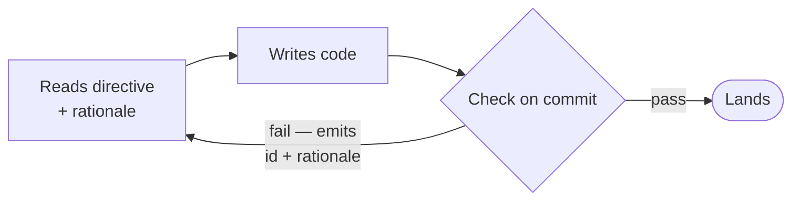

# governance-kit

**Declare the repo state you want. Let agents converge on it.**

governance-kit turns your repo's rules into a versioned constitution — a declarative description of the state the repository must stay in. Agents read it, checks compare it against reality on every commit, and every agent-authored change leaves a git-native audit trail.

Conforms to the [Agent Skills](https://agentskills.io) format. Installs into [Claude Code](https://docs.anthropic.com/en/docs/claude-code), [Codex](https://github.com/openai/codex), Cursor, OpenCode, and 40+ skills-compatible agents via [`npx skills`](https://github.com/vercel-labs/skills). MIT-licensed.

> [!NOTE]
> **Built for agent-heavy engineering teams.** If you're spec-driving features for an agent to implement, [spec-kit](https://github.com/github/spec-kit) is the right fit. governance-kit is the layer above — keeping the rules your agent must satisfy on every commit from drifting out of sync with the code, the tests, or each other.

---

## Why governance-driven development?

Coding agents do the engineering work now. The hard part is no longer just telling one agent what to do in one session; it is keeping the repository understandable across many branches, many agents, and many handoffs.

governance-kit treats governance as repo state:

- **Desired state** lives in `CONSTITUTION.md`: directives, rationale, enforcement paths, exceptions, and an evolution log.
- **Current state** is the working tree, staged diff, commit message, PR state, receipts, and ledgers.
- **Reconciliation** happens through `.governance/run.sh` and hook dispatchers. A failed directive names the gap and its rationale; the agent fixes the repo, reruns the check, and repeats until reality matches the declared state.
- **Abstractions** keep humans out of low-level ceremony. You reason about directives, packs, receipts, and ledgers instead of scattered hook scripts, chat transcripts, and one-off agent instructions.

That gives a practical steering surface. Your guidance has to reach the next agent, on the next branch, without you. governance-kit's answer is a **constitution**: a versioned set of directives every agent reads on every commit, plus a `STEERING.md` ledger that captures the per-turn redirects you did not promote into a directive.

It also gives a practical visibility surface. When agents ship the diffs, you need a readable trail, not a stack of PRs. Every agent-authored commit can leave append-only ledgers — `CONSTITUTION.md` (rules + evolution log), `COSTS.md` (token cost), `STEERING.md` (where you had your hand on the wheel). Git-native. You read the repo's state record, not the chat history.


Agents do the work. The constitution describes the state the repo must satisfy. The directives keep both sides honest — a frontier-model agent reading a directive's rationale generalizes to cases the author never encoded; you read the ledgers as the state record for what the agent fleet just shipped.

The stance in one line: **describe the state, continuously check reality, and let agents reconcile the difference.**

## Visibility

If you're trusting agents to ship code, you need to see exactly what they were told, what they did against each issue, what it cost, and how much you had to steer them. Four git-native, append-only artifacts:

- **Directive provenance** (`CONSTITUTION.md`). Every line is git-blameable to the commit that introduced it and the test that enforces it. The **Evolution Log** at the bottom of the file carries a dated, human-readable summary of every amendment. Because the CLI verbs require the check, the rationale, and the log entry to land together, policy and enforcement can't silently diverge.
- **Per-issue receipts** (`receipts/issue-<N>-*.md`). One receipt per issue, with `## Checklist`, `## What changed`, `## Out of scope`, and `## Verification` sections. Every `- [x]` checklist item must crosswalk into `## What changed` or `## Verification` — the trust boundary that prevents silent box-flipping. The receipt is what a reviewer reads instead of the diff.
- **Token cost** (`COSTS.md`). Every agent-authored commit carries token + cost trailers (`Token-Input`, `Token-Output`, `Cost-USD`, …) and a matching row in the ledger. Survives squash-merges via a stable `Cost-Key`. Every change has a price tag.
- **Human steering** (`STEERING.md`). Every commit carries summary trailers (`Steer-Count`, `Steer-Types`, `Steer-Tiers`) tallying the rows it added to the ledger — one row per detected human-steering event (interrupt or redirect). See at a glance which commits ran on autopilot and which needed your hand on the wheel.

These compose into a chain — **issue → receipt → commit → cost** — and breaking any link fails the next push. Directive provenance, the chain, and token cost all ship in the [`governance-kit/core`](#whats-in-core) pack and land in the `standard` preset. Steering accounting (`agent-steering-accounting`) ships in the same pack and is `always_install: true` — mandatory in every install (it records human correction text verbatim — redact via the directive's classifier hook rather than skipping it).

## Quickstart

```sh
# Install the skill into your agent (see Lifecycle for scope options)
npx skills add Duaility/governance-kit

# In a fresh repo, launch your agent and ask it to bootstrap
claude
> governance init
```

`npx skills` auto-detects [governance/SKILL.md](governance/SKILL.md) and symlinks it into every skills-compatible runtime on your machine (`~/.claude/skills/`, `~/.codex/skills/`, `~/.cursor/skills/`, …). `governance init` bootstraps `CONSTITUTION.md`, `.governance/`, a pre-commit hook, and the `governance-kit/core` pack.

Make a bad commit to see the gate fire:

```sh
$ git commit -m "stuff"
[FAIL] commit-message-format — pending commit — 'stuff' does not match
       Conventional Commits with an issue suffix (<type>(scope)?: <subject> (#123))
```

The agent reads the id + rationale and self-corrects on the next attempt.

## How it ships

### Verbs

```
governance init                                        # bootstrap a repo
governance kit update [--with-packs|--dry-run|--force] # re-sync runtime files to a new kit version
governance pack {list,search,add,update,remove,create} # pack lifecycle (community + repo-local)
governance directive {add,modify,remove} [--pack …]    # atomic directive amendments
governance reset {--directive <id>|--pack <id>|--all}  # restore drifted directives to the pinned version
governance uninstall [--dry-run|--soft|--hard]         # tear-down
```

Full install / update / uninstall usage for both layers is in [Lifecycle](#lifecycle) below.

### Anatomy of a directive

Every directive is a self-contained folder. The minimum, here `doc-freshness` from the `governance-kit/core` pack:

```
doc-freshness/
├── directive.yaml    # category, summary, surface, hook
├── check.sh          # the executable test (pre-commit + CI)
├── constitution.md   # Directive / Rationale / Enforced by / Exceptions
└── evals/test.sh     # pass + fail fixtures
```

Directives that need more carry optional siblings — `lib/` (shared bash/Python), `hooks/<pre-commit|commit-msg|prepare-commit-msg|post-commit|pre-push>.sh` (side-effect scripts wired into the dispatcher by the hook generator), `runtimes/<name>.sh` (per-runtime helpers), and `install-assets/` (templates seeded at bootstrap). All travel with the directive — `git mv` relocates the whole folder. `agent-token-accounting` uses every one of these.

The `constitution.md` carries the *why*:

```markdown
### doc-freshness

- **Directive**: Docs opted into `.governance/freshness.conf` carry a
  `<!-- last-verified: YYYY-MM-DD -->` marker dated within the last 90 days.
- **Rationale**: Critical runbooks and onboarding docs decay. A periodic
  "someone re-read this" checkpoint keeps them honest — if the deadline
  passes, either bump the date or fix the doc.
- **Enforced by**: `.governance/packs/governance-kit/core/directives/doc-freshness/check.sh`
- **Exceptions**: Remove a doc from `freshness.conf` to opt it out.
```

A bare hook checks the date format. The rationale tells the next agent — and the next human — what the date is *for*.



### Composition

Directives are invariants on state, not steps in a procedure. Each one describes a condition the repo must satisfy; the runner re-evaluates them all on every firing. `.governance/run.sh` iterates `directives/*/check.sh` alphabetically — no `depends_on:`, no `order:`, no graph engine.

When directive B logically depends on directive A's postcondition — e.g. "PR must have a review" depends on "PR must exist" — B reads the precondition itself and skips-with-info if it's not met. The cascade falls out of re-evaluation: fix what's currently violating, re-run, the next gate fires, fix that, re-run, done.

This is declarative reconciliation applied to a repository. A directive describes the desired state; its check observes current state; the agent takes the mandated action; then `bash .governance/run.sh` surfaces the next gap. Don't chain actions; describe state and let re-evaluation converge.

### Core pack

Ships with `governance init`:

| Directive | What it checks |
|---|---|
| `commit-message-format` | Commit messages match `<type>(scope)?: subject (#123)` — Conventional Commits prefix plus a trailing GitHub issue reference. |
| `doc-freshness` | Opted-in docs carry a `<!-- last-verified: YYYY-MM-DD -->` marker within 90 days. |
| `no-broken-internal-doc-links` | Markdown links to local paths resolve. |
| `no-orphan-todos` | Every `TODO` / `FIXME` references an issue. |
| `repo-hygiene` | No merge markers, oversized files, build artefacts, debug statements, or overlong source files. |
| `required-docs` | Baseline root-level docs and hook scaffolding exist. |
| `secrets-hygiene` | No plaintext secrets in tracked files; `.env` is gitignored and untracked. |
| `workflows-hardened` | GitHub Actions workflows declare `permissions:` and pin third-party actions to a SHA. |

Full catalog: [governance/references/DIRECTIVES_CATALOG.md](governance/references/DIRECTIVES_CATALOG.md).

## Lifecycle

governance-kit has **two layers**, versioned independently on separate axes (the Helm `Chart.version` vs `appVersion` model — see [VERSIONING.md](governance/references/VERSIONING.md)):

- **The kit** — the framework: the `governance` skill, the runtime (`run.sh`, `lib.sh`), the hook generators, and the schemas. Released under `kit/vX.Y.Z`.
- **Packs** — the directive *content*: `governance-kit/core` ships with the kit; community packs live in their own repos. Released under `<pack>/vX.Y.Z` (e.g. `core/v0.4.0`).

`.governance/packs.lock` is the source of truth for **which** packs and versions a repo runs. The directive code itself is **vendored into `.governance/packs/<owner>/<name>/` and committed** — so the checks that enforce your repo are reviewable in your own diffs, and a pack bump shows the real `check.sh` change, not just a SHA. (The lock pins a SHA for integrity; committing the tree adds in-diff auditability — the `go mod vendor` / committed-Helm-`charts/` choice, justified because governance is a trust tool.)

### The kit

**Install** — add the skill to your agent(s) with [`npx skills`](https://github.com/vercel-labs/skills), then bootstrap a repo:

```sh
npx skills add Duaility/governance-kit -g              # all agents, user-wide
npx skills add Duaility/governance-kit -a claude-code  # one agent only
npx skills add Duaility/governance-kit                 # project-scoped, committed to the repo

# then, inside the target repo, ask your agent:
> governance init                                      # writes CONSTITUTION.md, .governance/, a pre-commit hook, the core pack
```

<details>
<summary>Manual install (no <code>npx</code>, or for hacking on the kit)</summary>

Clone and symlink the skill folder into each runtime you use:

```sh
git clone https://github.com/Duaility/governance-kit
cd governance-kit
ln -s "$(pwd)/governance" ~/.claude/skills/governance   # Claude Code
ln -s "$(pwd)/governance" ~/.codex/skills/governance    # Codex
```

Edits in the clone flow to every linked runtime live — handy when contributing to governance-kit itself.

</details>

**Update** — two independent things can move; update each on its own:

```sh
npx skills add Duaility/governance-kit                 # refresh the skill on your machine to the latest kit release
governance kit update [--with-packs] [--dry-run] [--force]
                                                       # inside a repo: re-sync the runtime files init seeded
                                                       # (run.sh, lib.sh, governance.yml, enable-governance.sh,
                                                       # hook dispatchers) to the kit version now on PATH
```

`kit update` is **disjoint** from `pack update`: it touches the framework runtime, never directive content. It diffs each kit-owned file and prompts per-file before writing; managed files carry a `# governance-kit:managed kit-version=<v>` marker that flags them as safe to regenerate. `--with-packs` chains a `pack update` afterward.

**Uninstall** — reverse everything `init` did:

```sh
governance uninstall --dry-run                         # preview (the default when state is ambiguous)
governance uninstall --soft                            # remove kit-owned files; keep pack-seeded docs (QUALITY.md, COSTS.md, …)
governance uninstall --hard                            # remove everything kit-owned
```

`uninstall` only deletes what it recognizes as kit-owned — manifest entries plus `# governance-kit:managed` markers — and never touches your content, unmarked hooks, or uncommitted changes. To remove the **skill** itself from your machine, delete the symlink your installer created (`npx skills` manages `~/.claude/skills/…`, `~/.codex/skills/…`, etc.).

### Packs

```sh
governance pack list                                   # what's installed, with versions
governance pack search [query]                         # browse the community catalog
governance pack add gh:acme/soc2-pack@v1.2.0           # install a community pack — pin a tag, not a branch
governance pack update [<pack-id>]                     # re-pin SHA + re-vendor the directive code; diffs before executing
governance pack remove <pack-id>                       # uninstall a pack (community or repo-local)
governance pack create <name>                          # scaffold a repo-local pack at .governance/packs/<you>/<name>/
```

- **Core pack.** `governance-kit/core` installs with `governance init` at your chosen preset (`minimal` / `standard` / `strict`) and updates like any other pack: `governance pack update governance-kit/core`.
- **Pin tags, not branches.** `@main` silently tracks the moving tip on every update; `@core/v0.4.0` is an immutable, reviewable pin. See [VERSIONING.md](governance/references/VERSIONING.md#tag-scheme).
- **`add` / `update` vendor the directive code** into `.governance/packs/<owner>/<name>/` and commit it — directives only (author-side `evals/` and `install-assets/` are stripped). `update` shows the diff before it runs, because that diff is check code that will run on your commits.
- **Community packs** live in their own repos and install via `governance pack add gh:<owner>/<repo>`. Authoring your own: [PACK_AUTHORING.md](governance/references/PACK_AUTHORING.md). Discovery reads the advisory catalog at [catalog.community.json](governance/assets/catalog.community.json) — currently empty; PRs welcome.

> [!IMPORTANT]
> Don't hand-edit `CONSTITUTION.md` or files under `.governance/`. The `directive {add,modify,remove}` and `reset` verbs keep the check, the rationale, and the evolution log in lockstep — hand-edits drift the constitution out of sync with the tests.

## What's in core

The kit ships exactly one bundled pack — `governance-kit/core`. Everything below comes with `governance init` at the chosen preset.

### General-purpose directives

| Directive | What it enforces | Preset |
|---|---|---|
| `required-docs` | `README.md`, `LICENSE`, `SECURITY.md`, `ARCHITECTURE.md` exist with non-empty bodies. | minimal |
| `secrets-hygiene` | No high-confidence secret patterns (AWS keys, GitHub tokens, Stripe live keys, etc.) committed to the tree. | minimal |
| `repo-hygiene` | `.gitignore` exists; tracked files stay under the size limit. | minimal |
| `workflows-hardened` | `.github/workflows/*.yml` declare `permissions:`, pin actions, and avoid `pull_request_target` foot-guns. | minimal |
| `no-broken-internal-doc-links` | Internal markdown links resolve. | minimal |
| `commit-message-format` | Conventional Commits with an issue suffix (`<type>(scope)?: <subject> (#N)`). | standard |
| `doc-freshness` | Docs in `.governance/freshness.conf` carry an in-window `<!-- last-verified: YYYY-MM-DD -->` marker. | standard |
| `no-orphan-todos` | Every `TODO`/`FIXME` references an issue. | strict |

### The agent audit chain

The chain — **issue → receipt → commit → cost** — turned into mechanical directives. Bundled into `standard` because every commit in this kit's mental model is agent-authored.

| Directive | What it enforces | Preset |
|---|---|---|
| `issue-templates` | `.github/ISSUE_TEMPLATE/` carries `config.yml` (blank issues off), `proposal.yml`, `bug.yml` with the required handoff fields. | standard |
| `issues-tracked` | `QUALITY.md` exists at repo root with `## Open` and `## Resolved` sections. | standard |
| `receipt-per-issue` | Every `receipts/*.md` has a unique `issue-<N>` filename token, the four required sections, and each `- [x]` checklist item crosswalks into `## What changed` or `## Verification`. | standard |
| `commit-issue-receipt-match` | Every non-merge commit's issue anchor (`(#N)` or `Issue: #N`) matches an `issue-<N>` token on a touched receipt. | standard |
| `doc-integrity` | **`always_install: true` — mandatory in every install.** Makes system-of-record documents append-only (config: `.governance/integrity.conf`, seeded with all rules enabled): receipts immutable once on the trunk, `COSTS.md`/`STEERING.md` ledgers append-only, and frozen sections (`QUALITY.md` Resolved, the Evolution Log) keep their baseline lines verbatim. Branch-authored content stays editable until it merges. | standard |
| `agent-token-accounting` | Every commit carries token + cost trailers and a matching `COSTS.md` row keyed by `Cost-Key`. | standard |
| `agent-steering-accounting` | Every commit stamps `Steer-Count` / `Steer-Types` / `Steer-Tiers` and appends rows to append-only `STEERING.md`. **`always_install: true` — mandatory in every install.** Records human correction text verbatim — redact via the directive's classifier hook rather than skipping it. | standard |

## Why not just pre-commit / husky / lefthook?

Those tools run hooks. governance-kit runs hooks **and** carries the rationale, the audit trail, and the evolution history alongside the test. A new maintainer can trace any directive back to its commit and its check. The `check.sh` scripts are plain bash — drop them into pre-commit or husky directly if you only want the enforcement half. See [governance/references/NATIVE_TESTS.md](governance/references/NATIVE_TESTS.md).

## Contributing

See [AGENTS.md](AGENTS.md) for repo layout, how to add directives to the `governance-kit/core` pack, and the dogfooding setup. One-time-per-clone:

```sh
./scripts/enable-governance.sh   # sets core.hooksPath=.githooks
```

Worktrees inherit this config — no per-worktree action needed.

## Releasing

The kit and the core pack version on **independent** axes (the Helm `Chart.version` vs `appVersion` model), so each is released on its own. Every release is cut by [`scripts/release.sh`](scripts/release.sh) — version lines are written **only** in `chore(release)` commits, never in feature or fix PRs. That is what lets the `version-consistency` directive treat any out-of-band edit to a version field as drift.

**Which axis to cut:**

- **`core`** — when a directive-content change has merged: a new/changed/removed directive, a preset edit, or a `check.sh` fix. Bumps `governance/assets/packs/core/pack.yaml`.
- **`kit`** — when a framework change has merged: runtime files (`run.sh`, `lib.sh`), hook generators, a verb/flag, or a schema/marker-format change. Bumps `governance/assets/kit.yaml` and re-stamps every derived kit-version copy (`SKILL.md` frontmatter, `install.yaml` `kit_version`, the `kit-version=` markers).

Pick the semver level from the [policy table](governance/references/VERSIONING.md#semver-policy).

```sh
bash scripts/release.sh <kit|core> <X.Y.Z> --dry-run   # preview the plan from any branch — bump, re-stamps, tag, CHANGELOG
bash scripts/release.sh core 0.4.0                      # cut a core pack release
bash scripts/release.sh kit 0.4.0                       # cut a kit release
bash scripts/release.sh <kit|core> <X.Y.Z> --push       # cut and push the branch + tag in one step
```

A real run preflights — it refuses unless you are on `main` with a clean tree, the target is valid semver strictly greater than current, the tag doesn't already exist, and `bash .governance/run.sh` is green. It then bumps the single source of truth, re-derives every stamp (kit axis only), regenerates the `CHANGELOG.md` section from the Conventional Commits since the last matching tag, makes the `chore(release)` commit through the hook path, and creates the prefixed annotated tag (`kit/vX.Y.Z` / `core/vX.Y.Z`). Pushing the tag triggers [`release.yml`](.github/workflows/release.yml), which lifts the matching CHANGELOG section into a GitHub Release.

Full procedure and invariants: [RELEASE_FLOW.md](governance/references/RELEASE_FLOW.md). Axes, semver policy, and the tag scheme consumers pin against: [VERSIONING.md](governance/references/VERSIONING.md).

## License

MIT
