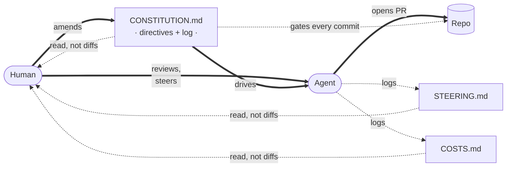

# governance-kit

**Frontier models do the work. You set the direction.**

governance-kit turns your repo's rules into a versioned constitution — read by every agent, enforced on every commit. Every agent-authored change leaves a git-native audit trail.

Conforms to the [Agent Skills](https://agentskills.io) format. Installs into [Claude Code](https://docs.anthropic.com/en/docs/claude-code), [Codex](https://github.com/openai/codex), Cursor, OpenCode, and 40+ skills-compatible agents via [`npx skills`](https://github.com/vercel-labs/skills). MIT-licensed.

> [!NOTE]
> **Built for agent-heavy engineering teams.** If you're spec-driving features for an agent to implement, [spec-kit](https://github.com/github/spec-kit) is the right fit. governance-kit is the layer above — keeping the rules your agent must satisfy on every commit from drifting out of sync with the code, the tests, or each other.

---

## Why governance-driven development?

Coding agents do the engineering work now. The human's job is steering, and steering at scale needs two things you don't get from code-review threads or a bullet in `CLAUDE.md`.

**Steering** — your guidance has to reach the next agent, on the next branch, without you. governance-kit's answer is a **constitution**: a versioned set of directives every agent reads on every commit, plus a `STEERING.md` ledger that captures the per-turn redirects you didn't promote into a directive.

**Visibility** — when agents ship the diffs, you need a readable trail, not a stack of PRs. Every agent-authored commit leaves three append-only ledgers — `CONSTITUTION.md` (rules + evolution log), `COSTS.md` (token cost), `STEERING.md` (where you had your hand on the wheel). Git-native. You read the ledgers, not the diffs.



Agents do the work. The constitution sets the bounds. The directives keep both sides honest — a frontier-model agent reading a rule's rationale generalizes to cases the author never encoded; you read the ledgers as the lens on what your fleet just shipped.

## Visibility

If you're trusting agents to ship code, you need to see exactly what they were told, what they did, what it cost, and how much you had to steer them. Three append-only ledgers, all git-native:

- **Directive provenance** (`CONSTITUTION.md`). Every line is git-blameable to the commit that introduced it and the test that enforces it. The **Evolution Log** at the bottom of the file carries a dated, human-readable summary of every amendment. Because the CLI verbs require the check, the rationale, and the log entry to land together, policy and enforcement can't silently diverge.
- **Token cost** (`COSTS.md`). Every agent-authored commit carries token + cost trailers (`Token-Input`, `Token-Output`, `Cost-USD`, …) and a matching row in the ledger. Survives squash-merges. Every change has a price tag.
- **Human steering** (`STEERING.md`). Every commit carries summary trailers (`Steer-Count`, `Steer-Types`, `Steer-Tiers`) tallying the rows it added to the ledger — one row per detected human-steering event (interrupt or redirect). See at a glance which commits ran on autopilot and which needed your hand on the wheel.

Token and steering ledgers ship in the [`agent-governance`](#community-packs) pack. Directive provenance is core.

## Quickstart

```sh
# Install the skill into your agent (see Install for scope options)
npx skills add Duaility/governance-kit

# In a fresh repo, launch your agent and ask it to bootstrap
claude
> governance init
```

`npx skills` auto-detects [governance/SKILL.md](governance/SKILL.md) and symlinks it into every skills-compatible runtime on your machine (`~/.claude/skills/`, `~/.codex/skills/`, `~/.cursor/skills/`, …). `governance init` bootstraps `CONSTITUTION.md`, `tests/governance/`, a pre-commit hook, and the `core` pack.

Make a bad commit to see the gate fire:

```sh
$ git commit -m "stuff"
[FAIL] conventional-commits — pending commit — 'stuff' does not match
       Conventional Commits with an issue suffix (<type>(scope)?: <subject> (#123))
```

The agent reads the id + rationale and self-corrects on the next attempt.

## How it ships

### Verbs

```
governance init                                       # bootstrap a repo
governance uninstall [--dry-run|--soft|--hard]        # tear-down
governance pack {search,add,update,remove,list}       # community pack lifecycle
governance directive {add,modify,remove}              # atomic directive amendments
```

> [!IMPORTANT]
> Don't hand-edit `CONSTITUTION.md` or files under `tests/governance/directives/`. The `directive *` verbs keep the check, the rationale, and the history in lockstep — hand-edits will drift the constitution out of sync with the tests.

### Anatomy of a directive

Every directive is a self-contained folder. Here's `doc-freshness` from the `core` pack:

```
doc-freshness/
├── directive.yaml    # category, summary, surface, hook
├── check.sh          # the executable test (pre-commit + CI)
├── constitution.md   # Directive / Rationale / Enforced by / Exceptions
└── evals/test.sh     # pass + fail fixtures
```

The `constitution.md` carries the *why*:

```markdown
### doc-freshness

- **Directive**: Docs opted into `tests/governance/freshness.conf` carry a
  `<!-- last-verified: YYYY-MM-DD -->` marker dated within the last 90 days.
- **Rationale**: Critical runbooks and onboarding docs decay. A periodic
  "someone re-read this" checkpoint keeps them honest — if the deadline
  passes, either bump the date or fix the doc.
- **Enforced by**: `tests/governance/directives/doc-freshness/check.sh`
- **Exceptions**: Remove a doc from `freshness.conf` to opt it out.
```

A bare hook checks the date format. The rationale tells the next agent — and the next human — what the date is *for*.


### Core pack

Ships with `governance init`:

| Directive | What it checks |
|---|---|
| `conventional-commits` | Commit messages match `<type>(scope)?: subject (#123)`. |
| `doc-freshness` | Opted-in docs carry a `<!-- last-verified: YYYY-MM-DD -->` marker within 90 days. |
| `no-broken-internal-doc-links` | Markdown links to local paths resolve. |
| `no-orphan-todos` | Every `TODO` / `FIXME` references an issue. |
| `repo-hygiene` | No merge markers, oversized files, build artefacts, debug statements, or overlong source files. |
| `required-docs` | Baseline root-level docs and hook scaffolding exist. |
| `secrets-hygiene` | No plaintext secrets in tracked files; `.env` is gitignored and untracked. |
| `workflows-hardened` | GitHub Actions workflows declare `permissions:` and pin third-party actions to a SHA. |

Full catalog: [governance/references/DIRECTIVES_CATALOG.md](governance/references/DIRECTIVES_CATALOG.md).

## Install

The recommended path is [`npx skills`](https://github.com/vercel-labs/skills), the open install CLI for [Agent Skills](https://agentskills.io):

```sh
npx skills add Duaility/governance-kit -g              # all agents, user-wide
npx skills add Duaility/governance-kit -a claude-code  # one agent only
npx skills add Duaility/governance-kit                 # project-scoped, committed to repo
```

<details>
<summary>Manual install (no <code>npx</code>, or for hacking on the kit)</summary>

Clone and symlink the skill folder into each runtime you use:

```sh
git clone https://github.com/Duaility/governance-kit
cd governance-kit
ln -s "$(pwd)/governance" ~/.claude/skills/governance   # Claude Code
ln -s "$(pwd)/governance" ~/.codex/skills/governance    # Codex
```

Edits in the clone flow to both runtimes live — handy when contributing to governance-kit itself.

</details>

## Community packs

| Pack | Purpose | Install |
|---|---|---|
| [duaility/agent-governance](https://github.com/Duaility/governance-kit/tree/main/extensions/packs/agent-governance) | Agent-driven discipline: issue templates, issue tracking, receipt-per-issue, commit-issue-receipt match, per-commit token + steering accounting. | `governance pack add gh:Duaility/governance-kit/extensions/packs/agent-governance` |

Authoring your own pack: [governance/references/AUTHORING_PACKS.md](governance/references/AUTHORING_PACKS.md).

## Why not just pre-commit / husky / lefthook?

Those tools run hooks. governance-kit runs hooks **and** carries the rationale, the audit trail, and the evolution history alongside the test. A new maintainer can trace any directive back to its commit and its check. The `check.sh` scripts are plain bash — drop them into pre-commit or husky directly if you only want the enforcement half. See [governance/references/NATIVE_TESTS.md](governance/references/NATIVE_TESTS.md).

## Contributing

See [AGENTS.md](AGENTS.md) for repo layout, how to add directives to the `core` pack, and the dogfooding setup. One-time-per-clone:

```sh
./scripts/setup-clone.sh   # sets core.hooksPath=.githooks
```

Worktrees inherit this config — no per-worktree action needed.

## License

MIT
