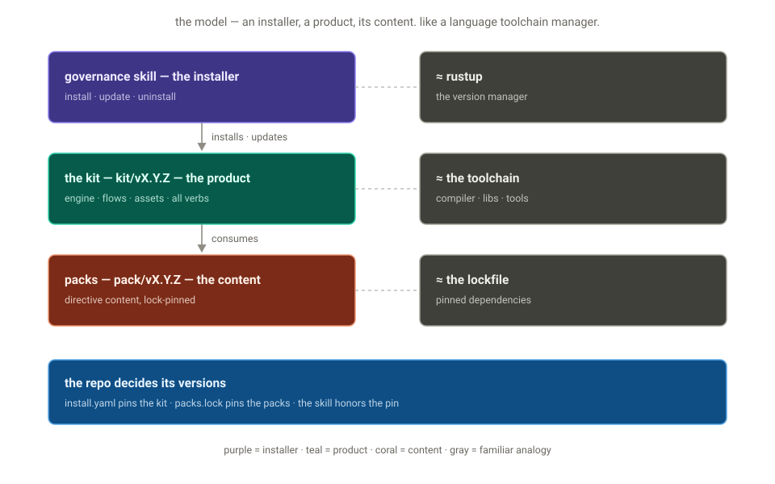

<div align="center">

<picture>
  <source media="(prefers-color-scheme: dark)" srcset="docs/assets/banner-dark.png">
  
</picture>

<p align="center">Give every coding agent the same repo memory</p>

</div>

<p align="center"><strong>keep every agent coherent with your repo · stop re-teaching them · expose token spend · rules live in git · MIT</strong></p>

<p align="center">
  <a href="https://github.com/Duaility/governance-kit/actions/workflows/governance.yml"></a>
  <a href="https://github.com/Duaility/governance-kit/tags"></a>
  <a href="https://agentskills.io"></a>
  <a href="LICENSE"></a>
</p>

<p align="center">
  <a href="#why-governance-kit">Why</a> ·
  <a href="#quickstart">Quickstart</a> ·
  <a href="#concepts">Concepts</a> ·
  <a href="#should-you-adopt-it">Adopt</a> ·
  <a href="#reference-and-community">Reference</a>
</p>

<p align="center"><sub>
  <b>AI agents:</b> start at <a href="AGENTS.md"><code>AGENTS.md</code></a> — the rules you must satisfy live in <a href="CONSTITUTION.md"><code>CONSTITUTION.md</code></a>.
</sub></p>

---

## Why Governance Kit

### What problem does it solve?

Coding agents often complete the task in a way that is locally fine and globally wrong.

They land features through the wrong layer, revive patterns you retired, widen boundaries you wanted held, or half-follow `AGENTS.md` and miss the constraint that mattered. The objective passes; the repo drifts. The next agent has no memory of the correction, so you give it again.

Adding more prompt is the obvious fix, but it does not scale. Instruction files grow, context gets crowded, and the rule still only reaches the current session.

### What does Governance Kit change?

Governance Kit turns repeated corrections into **repo-native invariants**. It calls that set of invariants a **constitution**: `CONSTITUTION.md` is the readable policy, while each directive carries the rationale and executable check beside it. Hooks and CI run those checks on every commit.

It also keeps an audit trail. **Receipts** record what changed, what was tested, and which agent session authored the work. Reviewers and future agents can read that record without needing chat history, usage data, or harness-private state.

Once agents do real work, the repo can carry rules like:

- catch boundary drift before anyone debates code quality
- stop a small fix from becoming a rewrite
- require receipts to name changed behavior, verification, and risk
- record the producing agent session in git

### How does the loop work?

The repo carries the durable instruction. The agent reconciles reality against it.


This is the [harness-engineering](https://openai.com/index/harness-engineering/) move: coherence comes from executable rails around the agent, not ever-larger instruction blobs. Governance Kit packages that stance for ordinary repos, then adds versioned packs and git-native receipts so teams can share, pin, review, and evolve those rails.

## Quickstart

### How do you install it in 60 seconds?

```sh
# 1 — install the skill into every skills-compatible agent on your machine
npx skills add Duaility/governance-kit

# 2 — in a fresh repo, ask your agent to bootstrap
claude
> governance init      # writes CONSTITUTION.md, .governance/, a pre-commit hook, the bundled packs

# 3 — watch the gate fire
git commit -m "stuff"
```

```
[FAIL] commit-message-format — pending commit — 'stuff' does not match
       Conventional Commits with an issue suffix (<type>(scope)?: <subject> (#123))
```

The agent reads the directive id + rationale and self-corrects on the next attempt. The rule is no longer a reminder you have to paste into every new session.

What you installed is a thin shim — two files. The kit itself (rules, packs, templates, every other verb) is fetched from the released `kit/vX.Y.Z` tag and pinned per repo. See [Commands you will use](#which-commands-will-you-use).

The skill installs into [Claude Code](https://docs.anthropic.com/en/docs/claude-code), [Codex](https://github.com/openai/codex), Cursor, OpenCode, and other Agent Skills-compatible runtimes via [`npx skills`](https://github.com/vercel-labs/skills). Because each repo pins the kit and pack versions that actually run, every agent in the project hits the same constitution.

### Which commands will you use?

```
governance init                                        # bootstrap a repo
governance kit update [--with-packs|--dry-run|--force] # re-sync runtime files to a new kit version
governance pack {list,search,add,update,remove,create} # pack lifecycle (community + repo-local)
governance directive {add,modify,remove} [--pack …]    # atomic directive amendments
governance reset {--directive <id>|--pack <id>|--all}  # restore drifted directives to the pinned version
governance uninstall [--dry-run|--soft|--hard]         # tear-down
```

<div align="center">

<picture>
  <source media="(prefers-color-scheme: dark)" srcset="docs/assets/lifecycle-dark.svg">
  
</picture>

</div>

The **kit** (framework: runtime, hook generators, engines, schemas; tagged `kit/vX.Y.Z`) and **packs** (directive content, each on its own `pack.yaml` version) version on two independent axes — the Helm `Chart.version` vs `appVersion` model. `.governance/packs.lock` pins what runs, and the check code is vendored and committed so a pack bump shows the real `check.sh` diff, not just a SHA. Per-verb behavior: [VERBS.md](kit/references/VERBS.md). The two version axes and the tag scheme: [VERSIONING.md](kit/references/VERSIONING.md).

> [!IMPORTANT]
> Don't hand-edit `CONSTITUTION.md` or files under `.governance/`. The `directive {add,modify,remove}` and `reset` verbs keep the check, the rationale, and the evolution log in lockstep — hand-edits drift the constitution out of sync with the tests.

<details>
<summary><b>Manual install (no <code>npx</code>, or for hacking on the kit)</b></summary>

Clone and symlink the skill folder into each runtime you use:

```sh
git clone https://github.com/Duaility/governance-kit
cd governance-kit
ln -s "$(pwd)/skill" ~/.claude/skills/governance   # Claude Code
ln -s "$(pwd)/skill" ~/.codex/skills/governance    # Codex
```

Edits in the clone flow to every linked runtime live — handy when contributing to governance kit itself.

</details>

## Concepts

Once agents do real work against your repo, Governance Kit gives you:

- **Executable constitution** - `CONSTITUTION.md` is readable policy, and every directive has enforcement beside it.
- **Agent-readable failures** - violations name the rule, the gap, and the rationale, so the next agent turn has useful context.
- **Session provenance** - issue receipts record which harness/session authored a change without retaining transcripts, usage, cost, or steering data.
- **Judgment where needed** - semantic rules can require fresh-context sub-agent attestations instead of pretending grep is enough.
- **Versioned governance packs** - teams can publish and pin reusable packs such as `acme/backend`, `acme/soc2`, or `duaility/governance-kit`.

The rest of this section unpacks the three ideas behind those: how deep a rule can go, what a pack is, and what ships in the box.

### How strict can a rule be?

The key power is the depth of invariants you can express. Start with deterministic checks; escalate only when the rule genuinely needs context or judgment.

| Depth | What the user can say | How it runs |
|---|---|---|
| **Repo state** | "Every repo needs a README, license, security contact, and architecture note." | Cheap `check.sh` over the tree, run locally and in CI. |
| **Change set** | "A CI config change needs a reason in the commit." "A receipt for issue #42 must mention the files this PR actually changed." | Diff-aware hooks plus CI's merge-base walk. |
| **Ledger** | "For each agent-authored change, show the issue, receipt, and producing session." | Session identity rows, validated by directives. |
| **Sub-agent attestation** | "Before merging a cross-layer refactor, have a fresh reader compare the diff to the architecture map." | Hook fails with a fresh-context sub-agent prompt; agent records a PASS/REFUTED section; hook verifies presence. |

The failures that hurt are rarely mechanical ("forgot the formatter") — they're semantic, and no single enforcement style catches both. Governance kit matches each rule to a surface: cheap deterministic checks for the mechanical, [fresh-context attestation](kit/references/JUDGE.md) for the judgment calls.

### What are packs?

A pack is a versioned bundle of invariants. Each directive is a self-contained folder — metadata, executable check, constitution text, defaults, helper code, and pass/fail evals — so installing a pack hands the target repo the rule, the rationale, the hook wiring, and the lockfile pin together. The mechanics (folder anatomy, the install → lockfile → vendored-code → hooks flow) live in [PACK_AUTHORING.md](kit/references/PACK_AUTHORING.md).

Bundled packs cover foundation, commits, and the agent audit chain. Custom packs are where the project becomes specific to your organization — architecture boundaries, service ownership, migration rules, compliance evidence, review rituals, or repeated "please never do that again" corrections:

| Pack idea | Invariants it could carry |
|---|---|
| `acme/platform` | "No service reaches across the platform boundary." "Generated clients are refreshed with API schema changes." |
| `acme/security` | "Auth changes update threat-model evidence." "Privileged workflows explain permissions changes." |
| `acme/migration-2026` | "No new writes hit the legacy store." "Fallback paths are deleted, not hidden behind flags." |
| `acme/mobile` | "User-visible copy changes update localization receipts." "Feature-flag removals clean up both client and server paths." |

### What ships with it?

Three concern packs ship in-tree and install with `governance init` at your chosen preset (`minimal` / `standard` / `strict`):

| Pack | Covers | Preset |
|---|---|---|
| `governance-kit/foundation` | Required docs, internal link integrity, repo hygiene, managed-tree integrity | minimal |
| `governance-kit/commits` | Conventional Commits + issue suffix, TODO and suppression discipline | standard–strict |
| `governance-kit/audit` | The agent audit chain — receipts, session identity, record integrity | standard |

Full catalog: [DIRECTIVES_CATALOG.md](kit/references/DIRECTIVES_CATALOG.md). The anatomy of a directive folder and how to write one: [DIRECTIVE_AUTHORING.md](kit/references/DIRECTIVE_AUTHORING.md).

<details>
<summary><b>Every directive, with presets</b></summary>

#### Which general-purpose directives ship?

| Pack | Directive | What it enforces | Preset |
|---|---|---|---|
| `foundation` | `required-docs` | `README.md`, `LICENSE`, `SECURITY.md`, `ARCHITECTURE.md` exist with non-empty bodies. | minimal |
| `foundation` | `internal-doc-links` | Internal markdown links resolve; opt-in, every doc stays reachable from a root. | minimal |
| `foundation` | `managed-tree-integrity` | The vendored `.governance/` tree matches the content digests recorded at install/update time — hand-edits to any check or runtime file fail the gate, offline. Subsumes the kit-version-marker check. | minimal |
| `foundation` | `repo-hygiene` | No merge markers, oversized files, build artefacts, or debug statements. | minimal |
| `commits` | `commit-message-format` | Conventional Commits with an issue suffix (`<type>(scope)?: <subject> (#N)`). | standard |
| `commits` | `no-orphan-todos` | Every `TODO` / `FIXME` references an issue. | strict |
| `commits` | `no-unjustified-suppressions` | Every lint / type-checker suppression (`@ts-ignore`, `# noqa`, …) references an issue. | strict |

#### What does the audit chain enforce?

| Pack | Directive | What it enforces | Preset |
|---|---|---|---|
| `audit` | `issue-templates` | `.github/ISSUE_TEMPLATE/` carries `config.yml` (blank issues off), `proposal.yml`, `bug.yml` with the required handoff fields. | standard |
| `audit` | `issues-tracked` | `QUALITY.md` exists at repo root with `## Open` and `## Resolved` sections. | standard |
| `audit` | `receipt-per-issue` | Every `receipts/*.md` has a unique `issue-<N>` filename token, required narrative/audit sections, and checked items that crosswalk into the receipt's evidence. | standard |
| `audit` | `commit-issue-receipt-match` | Every non-merge commit adds or updates a `receipts/issue-<N>.md` — the touched receipt path is the commit's issue anchor (file-first). | standard |
| `audit` | `agent-session-identity` | **`always_install: true`** — each agent-authored commit records its harness and session identifier in the issue receipt. It reads only explicit identity signals and never touches transcripts, usage, cost, or steering data. | standard |
| `audit` | `doc-integrity` | **`always_install: true`** — system-of-record documents are tamper-proof: receipts freeze once on the trunk, frozen sections (`QUALITY.md` Resolved, the Evolution Log) keep their baseline lines verbatim. Branch-authored content stays editable until it merges. | standard |
| `audit` | `toolchain-config-protection` | A commit changing lint / format / type-check / CI / hook config carries a `governance: allow-toolchain-config <reason>` body line. | standard |

</details>

## Should you adopt it?

### Does this repo use it?

- **17 synchronous directive checks gate this repo** — the same packs `governance init` installs, plus a repo-local pack
- **It dogfoods semantic invariants** — `ARCHITECTURE.md` is itself gated by an architecture-map directive, and every PR receipt now carries fresh-context attestations such as `## Audit` and `## Layer boundaries`
- **The committed `.governance/` tree is an honest customer of the last release** — pinned at real published tags, moved only by the real `pack update` / `update` verb, so every release exercises the update path
- **Its integrity is self-enforced** — the `managed-tree-integrity` directive recomputes the content digests recorded at install time on every commit, so a hand-edit to any vendored check or runtime file fails the gate, offline

Reproduce: clone this repo and run `bash .governance/run.sh`. The dogfood setup: [AGENTS.md](AGENTS.md).

### When does it fit?

**Great fit if you…**

- keep repeating the same architectural or process corrections to coding agents
- switch between Claude Code, Codex, Cursor, OpenCode, or human edits in the same repo
- have watched an agent rewrite stable code, revive a deleted fallback, or move logic into the wrong layer
- want every agent-authored change to carry a durable harness/session identity
- want organization-specific rules packaged as reusable, versioned packs
- want semantic checks that admit when they need independent judgment instead of pretending grep is enough

**Skip it if you…**

- are spec-driving one feature at a time — that's [spec-kit](https://github.com/github/spec-kit); governance kit is the layer above
- only want hook execution — pre-commit / husky already do that, and every `check.sh` lifts into them directly ([NATIVE_TESTS.md](kit/references/NATIVE_TESTS.md))
- write all code by hand, solo, and do not need an audit trail

<details>
<summary><b>Integrations — run the checks from the toolchain you already have</b></summary>

`governance init` installs only the universal bash runner — zero dependencies. A consumer repo needs nothing but bash + git to commit. The kit's own tooling needs nothing but a bare `python3`. Nothing, anywhere, needs a package manager or a third-party package. Native wrappers are an additive opt-in ([NATIVE_TESTS.md](kit/references/NATIVE_TESTS.md)):

| Your setup | Hook in with |
|---|---|
| Bare git | `governance init` wires the hook dispatchers for you |
| CI | the seeded governance workflow re-runs every directive on every PR |
| pytest | a test module that shells out to each `check.sh` — violations appear in the normal test report |
| jest / vitest · go test | same pattern, per-framework snippets in the doc |
| husky · pre-commit.com · lefthook | call `bash .governance/run.sh` from the hook they manage |

</details>

### How does it compare?

|  | Governs | Blocks a bad commit | Rationale travels with the rule | Agent audit trail |
|---|---|:---:|:---:|:---:|
| **governance kit** | Repo state — docs, commits, receipts | Yes | Yes — constitution + evolution log | Yes — issue → receipt → commit → session identity |
| pre-commit · husky · lefthook | Hook execution | Yes | No | No |
| [spec-kit](https://github.com/github/spec-kit) | One feature's spec → implementation | No | Per-spec | No |
| Agent instruction files alone | What agents are told, not what they do | No | No | No |

> **Complements, not competitors.** If you're spec-driving features for an agent to implement, spec-kit is the right fit — governance kit is the layer above, keeping the rules your agent must satisfy on every commit from drifting out of sync with the code, the tests, or each other. And every `check.sh` is plain bash: drop them into pre-commit or husky directly if you only want the enforcement half ([NATIVE_TESTS.md](kit/references/NATIVE_TESTS.md)).

### Can you use it from any agent?

| Runtime | `npx skills add` | Notes |
|---|:---:|---|
| Claude Code | ✅ | symlinked into `~/.claude/skills/` |
| Codex | ✅ | symlinked into `~/.codex/skills/` |
| Cursor | ✅ | symlinked into `~/.cursor/skills/` |
| OpenCode | ✅ | |
| 40+ other runtimes | ✅ | anything that reads the [Agent Skills](https://agentskills.io) format |

The skill itself is a two-file shim; every verb executes from the kit version the target repo pins — so every runtime drives identical behavior, and updating the kit never requires reinstalling the skill.

## Reference and community

### Where should you read next?

Use the published site for learning and the kit references for exact behavior. The reference pages on the site are generated from `kit/references/*.md`, so the kit reference remains the source of truth.

| Need | Start here |
|---|---|
| Install and see the first gate fire | [Quickstart](https://duaility.github.io/governance-kit/guide/quickstart) |
| Understand the model | [Introduction](https://duaility.github.io/governance-kit/guide/introduction), [mental models](https://duaility.github.io/governance-kit/guide/mental-models), [constitution](https://duaility.github.io/governance-kit/concepts/constitution) |
| Operate an installed repo | [Configuration](https://duaility.github.io/governance-kit/guide/configuration), [troubleshooting](https://duaility.github.io/governance-kit/guide/troubleshooting), [verbs](kit/references/VERBS.md) |
| Pick or audit directives | [Directive catalog](kit/references/DIRECTIVES_CATALOG.md), [audit chain](https://duaility.github.io/governance-kit/concepts/audit-chain) |
| Write your own governance | [Directive authoring](kit/references/DIRECTIVE_AUTHORING.md), [pack authoring](kit/references/PACK_AUTHORING.md) |
| Integrate with existing hooks or test runners | [Native tests](kit/references/NATIVE_TESTS.md) |

### How do you contribute?

```sh
git clone https://github.com/Duaility/governance-kit && cd governance-kit
git config core.hooksPath .githooks   # one-time per clone — enables the local hooks
bash .governance/run.sh               # run the full directive suite
```

Skipping the `core.hooksPath` line only costs you local fast-feedback; CI still enforces every directive on every PR.

Repo layout, adding directives, and the dogfooding setup: [AGENTS.md](AGENTS.md). Releasing (maintainers): version lines are written only by [`scripts/release.sh`](scripts/release.sh) in `chore(release)` commits — full procedure in [RELEASE_FLOW.md](kit/references/RELEASE_FLOW.md).

### Where is the community?

- **[Issues](https://github.com/Duaility/governance-kit/issues)** — bugs and proposals; blank issues are off, and the templates carry the agent-handoff fields the audit chain expects
- **[Community pack catalog](kit/assets/catalog.community.json)** — the advisory index `governance pack search` reads; currently empty, PRs welcome

### What is the license?

MIT — see [LICENSE](LICENSE).
