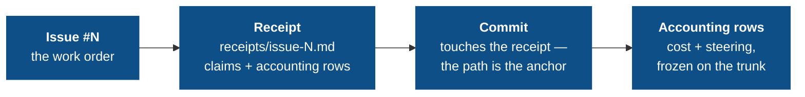

# The audit chain

If you trust agents to ship code, you need to see what they were told, what they did against each issue, what it cost, and how often you had to grab the wheel. The audit chain turns that into mechanical directives over git-native, tamper-evident artifacts.

## The chain



Every link is enforced by a directive in the `governance-kit/audit` pack (the `standard` preset); breaking any link fails the next push:

| Link | Directive | What it enforces |
|---|---|---|
| Issues exist & are structured | `issue-templates`, `issues-tracked` | Issue forms with handoff fields; a `QUALITY.md` board with `## Open` / `## Resolved` |
| Work attests itself | `receipt-per-issue` | One receipt file per issue with the required sections and a crosswalked checklist |
| Commits anchor to work | `commit-issue-receipt-match` | Every non-merge commit touches its issue's `receipts/issue-<N>.md` — the receipt path **is** the anchor |
| Work carries its price | `agent-token-accounting` | Each agent session that touches the issue is one row in its receipt: identity stamped at commit time, usage filled in off the commit path from the harness's own surfaces |
| Steering is visible | `agent-steering-accounting` | Each human-steering event is a row in the issue's receipt; the ledger shape is validated |
| The record can't be rewritten | `doc-integrity` | Receipts freeze once on the trunk; frozen sections keep their baseline lines verbatim |

Everything homes in the receipt. There are **no accounting commit trailers** — that was the design before issue #293; the rows now live only in `receipts/issue-<N>.md`, which `doc-integrity` already freezes on the trunk. A commit-message copy of facts already in the receipt added a denormalised projection and a squash-merge re-validation dance, and bought nothing the frozen receipt didn't already give you.

## Receipts: attestation over promise

A plan says what the model *intends*; a receipt says what it *did*, in a form a reviewer can check. One receipt per issue, at `receipts/issue-<N>-<slug>.md`, with four required sections — plus an `## Accounting` section that carries the issue's cost and steering rows:

```markdown
## Checklist        # mirrors the GitHub issue's acceptance items
## What changed     # the actual changes, by file/behavior
## Out of scope     # explicitly not done
## Verification     # how each claim was checked
## Accounting       # ### Costs and ### Steering rows, maintained per session / per event
```

The trust boundary: **every `- [x]` checklist item must crosswalk** — its text must appear in `## What changed` or `## Verification`. An agent cannot flip a box without writing down what it did and how that was verified. The receipt is what a reviewer reads instead of the raw diff.

`commit-issue-receipt-match` ties commits to receipts the other direction, and it does it **file-first**: every non-merge, non-revert commit must add or modify at least one `receipts/issue-<N>.md`, and the touched receipt's filename *is* the issue anchor. That path sits in the diff identically before and after a squash-merge — where the subject flips to the PR number — so the link survives the squash with no body trailer to recover it. (The subject's own `(#N)` is still required, separately, by `commit-message-format`.)

## Cost accounting: every change carries its usage

`agent-token-accounting` records each agent session that worked on the issue as exactly one row (v6, 10 columns) under `## Accounting` → `### Costs` in the issue's receipt:

```
| date | harness | session | model | input | cache-create | cache-read | output | cost-usd | source |
```

The design principle is a split the earlier versions didn't make: **identity is knowable at commit time; the cost isn't**. A pre-commit hook is the worst possible measurement point — synchronous, blocking, unretryable, racing a live session whose spend isn't even final yet. So the two halves separate:

- **Identity at commit.** The harness announces itself in the environment of every subprocess it spawns; the `pre-commit` writer records *which harness, which session* and validates structure. It never reads a harness file, never parses a transcript, and does no arithmetic — pure bash over kit-owned files, so it cannot block a commit for measurement reasons.
- **Measurement at rest.** `post-commit` and `pre-push` sweeps — off the commit path, non-blocking, retryable — ask each session's runtime adapter to refresh a kit-owned snapshot sidecar in the worktree's git dir, reading only *declared* surfaces: a payload the harness itself pushed, a file the harness itself named, a local server the harness itself runs. The next commit folds the freshest snapshot back into the row. A failed read means "try again later", never a guessed number.
- **The numbers are session-cumulative, not per-commit deltas.** The canonical flow squash-merges every branch, so per-intermediate-commit precision was machinery for a granularity the workflow throws away. One row per session, updated in place while the PR is open, frozen with the receipt on the trunk.
- **`source` is the provenance label** — `harness-feed` (the harness pushed it), `session-file` (a harness-declared file), `server` (a harness-run local endpoint), `manual` (self-declared, and permanently marked as such), or `unresolved`. A mixed-harness ledger stays readable because every number says where it came from.

**The kit never prices, and it never guesses.** Up to v4 it shipped a per-model rate card — every entry a guess about someone else's billing that could even block a commit over an unknown model. v5 deleted the pricing; v6 deletes the other guess: session discovery by newest-file heuristics is gone, and an unidentifiable session yields an `unresolved` row, not a plausible-looking wrong one. An empty `cost-usd` next to `source = codex` is the honest record of "that harness does not report dollars", not a bug. The whole path — commit-time stamp and off-path resolver alike — is bash + POSIX awk.

## Steering accounting: where the human grabbed the wheel

`agent-steering-accounting` records **human steering events** — interrupts and corrections — as rows under `## Accounting` → `### Steering` in the issue's receipt:

```
| steer-key | session | issue | type | tier | user-reason | commit | ordinal | timestamp |
```

`ordinal` and `timestamp` are the event's absolute transcript coordinates: `ordinal` is its 1-based position in the session's deterministic event stream, and dedup is identity-based — a given `(session, ordinal)` is appended exactly once, ever, which is what makes a cross-branch re-append detectable after a merge.

Deciding whether a message is a *correction* is a model judgment, so it is made by a **fresh-context sub-agent** handed the session transcript — a `judge:` attestation (the same mechanism as the receipt `## Audit` and `## Layer boundaries` verdicts), batched into one sub-agent per commit. This replaced an in-hook `claude -p` classifier whose throwaway transcript polluted token accounting and made the commit hook online (issue #325); the commit hook now makes **no** network call. The sub-agent records each event and writes a `## Steering` `PASS`/`REFUTED` verdict; `check.sh` gates that verdict's presence and validates the ledger shape. Tool *denials* are excluded by design — a "deny" click is usually "I'll do it myself", not an intent redirect. The point is rule-layer steering: where humans repeatedly steer is the signal for which directives are missing or misaligned.

<Note>
This directive (and `doc-integrity`) is `always_install: true` — the audit model depends on it unconditionally. `user-reason` records operator-intent text in the receipt, so it becomes part of the repo's public history. Think hard before installing on a public repo.
</Note>

## doc-integrity: the record cannot be quietly rewritten

An audit trail you can edit is not an audit trail. `doc-integrity` makes the system-of-record documents tamper-evident, driven by standard rules in its `defaults.conf` (layered with the `.governance/conf/governance-kit/audit/doc-integrity.conf` overlay) with three rule shapes:

| Rule | Semantics |
|---|---|
| `frozen-files <glob>` | Once a matching file is on the trunk, it is immutable. New files are fine. (Receipts — which carry the accounting rows — and the sealed legacy `COSTS.md` / `STEERING.md` ledgers.) |
| `append-only <file>` | The trunk version must remain a byte-prefix of the current version. |
| `frozen-section <file> <heading>` | Lines under the heading survive verbatim; the rest of the file is free. (`QUALITY.md` Resolved, the Evolution Log.) |

Everything is measured against the *trunk baseline* — branch-authored content stays editable until it merges, then freezes. This is the directive that makes the receipt-homed accounting rows trustworthy: once a receipt lands on the trunk, neither its cost rows nor its steering rows can be rewritten. Exceptions are path-scoped waivers in the commit body.

## Reading the record

The payoff is that oversight becomes *reading*, not *re-deriving*:

- A receipt's `### Costs` rows answer "what did this issue cost?" with grep.
- Its `### Steering` rows answer "where do agents go off the rails?" — input for the next directive.
- `receipts/` answers "what exactly landed for issue #N, and how was it verified?"

Next: [Limitations](/concepts/limitations) — the honest edges of what the commit path and the accounting can enforce.
