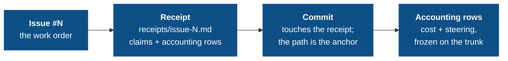

# The audit chain

If you trust agents to ship code, you need to see what they were told, what they did against each issue, what it cost, and how often you had to grab the wheel. The audit chain turns that into mechanical directives over git-native, tamper-evident artifacts.

## The chain



Every link is enforced by a directive in the `governance-kit/audit` pack (the `standard` preset); breaking any link fails the next push:

| Link | Directive | What it enforces |
|---|---|---|
| Issues exist & are structured | `issue-templates`, `issues-tracked` | Issue forms with handoff fields; a `QUALITY.md` board with `## Open` / `## Resolved` |
| Work attests itself | `receipt-per-issue` | One receipt file per issue with the required sections and a crosswalked checklist |
| Commits anchor to work | `commit-issue-receipt-match` | Every non-merge commit touches its issue's `receipts/issue-<N>.md`: the receipt path **is** the anchor |
| Work carries its price | `agent-token-accounting` | Each agent commit's token cost is one row in the issue's receipt, reconciled at commit time against the writer's frozen token endpoint |
| Steering is visible | `agent-steering-accounting` | Each human-steering event is a row in the issue's receipt; the ledger shape is validated |
| The record can't be rewritten | `doc-integrity` | Receipts freeze once on the trunk; frozen sections keep their baseline lines verbatim |

Everything belongs in the receipt. Accounting commit trailers were removed in issue #293. The rows now live only in `receipts/issue-<N>.md`, which `doc-integrity` already freezes on the trunk. Copying the same facts into a commit message added a denormalised projection and complicated squash-merge validation without adding useful evidence.

## Receipts: attestation over promise

A plan says what the model *intends*; a receipt says what it *did* in a form a reviewer can check. Each issue has one receipt at `receipts/issue-<N>-<slug>.md`. It contains four required sections plus an `## Accounting` section for cost and steering rows:

```markdown
## Checklist        # mirrors the GitHub issue's acceptance items
## What changed     # the actual changes, by file/behavior
## Out of scope     # explicitly not done
## Verification     # how each claim was checked
## Accounting       # ### Costs and ### Steering rows, appended per commit
```

The trust boundary is explicit: **every `- [x]` checklist item must crosswalk**. Its text must appear in `## What changed` or `## Verification`. An agent cannot flip a box without recording what it did and how it verified the result. The receipt gives reviewers a concise alternative to reading the raw diff first.

`commit-issue-receipt-match` ties commits back to receipts **file-first**. Every non-merge, non-revert commit must add or modify at least one `receipts/issue-<N>.md`, and the touched receipt's filename is the issue anchor. That path remains unchanged when a squash merge replaces the subject with the PR number, so the link survives without a body trailer. The subject's own `(#N)` remains a separate requirement of `commit-message-format`.

## Cost accounting: every change has a price tag

`agent-token-accounting` records each agent-authored commit's token cost as exactly one row under `## Accounting` → `### Costs` in the issue's receipt:

```
| cost-key | agent | session | issue | model | input | cache-create | cache-read | output | new-work | cost-usd | cum-input | cum-cache-create | cum-cache-read | cum-output | note |
```

The interesting part is what keeps the row honest across a session that spans branches and a squash that rewrites SHAs:

- **The `cum-*` columns are absolute coordinates.** They are the session's cumulative input / cache-create / cache-read / output counters at this commit, written blind from the transcript. They are the source of truth; the delta columns (`input` / `output` / `new-work` / `cost-usd`) are derived claims for display, so the row reads in isolation.
- **The endpoint, not a trailer, proves completeness.** At commit time the directive's `pre-commit` writer samples the transcript, writes the cost row, and freezes the sampled endpoint keyed by the staged tree under `.git/governance-token-endpoints/<tree>.json`. The `commit-msg` check then recomputes `git write-tree` and verifies the staged row matches that frozen endpoint: a missing endpoint means the runtime-aware hook never ran; a mismatch means the row doesn't record what the writer sampled.
- **`cost-key` is the stable join token**: opaque, globally unique across `receipts/*.md`, and the thing cross-issue reports group by. It is a join key, not a parseable structure.

Because rows store positions on a monotonic counter rather than quantities, double-counting is structurally impossible to write and provable to detect, and a commit made via `--no-verify` simply rolls its tokens into the next accounted row instead of corrupting the ledger.

`new-work = input + cache-create + output` (cache reads are tracked but excluded: you don't pay new-work rates to re-read a warm cache), and `cost-usd` is computed from the runtime-reported model via a rates table (`lib/rates.py`, extensible with `rate <model> …` rows in the overlay). Cross-issue totals come from a read-only aggregation over `receipts/*.md` (`lib/report.py`), not from scraping `git log`.

## Steering accounting: where the human grabbed the wheel

`agent-steering-accounting` records **human steering events**, including interrupts and corrections, as rows under `## Accounting` → `### Steering` in the issue's receipt:

```
| steer-key | session | issue | type | tier | user-reason | commit | ordinal | timestamp |
```

`ordinal` and `timestamp` are the event's absolute transcript coordinates: `ordinal` is its 1-based position in the session's deterministic event stream, and dedup is identity-based: a given `(session, ordinal)` is appended exactly once, ever, which is what makes a cross-branch re-append detectable after a merge.

Deciding whether a message is a *correction* requires model judgment. A **fresh-context sub-agent** receives the session transcript and produces a `subagent:` attestation, using the same mechanism as the receipt's `## Audit` and `## Layer boundaries` verdicts. Attestations are batched into one sub-agent per commit. This replaced an in-hook `claude -p` classifier whose throwaway transcript polluted token accounting and made the commit hook online (issue #325). The commit hook now makes **no** network call. The sub-agent records each event and writes a `## Steering` `PASS`/`REFUTED` verdict; `check.sh` requires that verdict and validates the ledger shape. Tool *denials* are excluded because a "deny" click usually means "I'll do it myself," not a change in intent. Repeated steering shows which directives are missing or misaligned.

<Note>
This directive (and `doc-integrity`) is `always_install: true`: the audit model depends on it unconditionally. `user-reason` records operator-intent text in the receipt, so it becomes part of the repo's public history. Think hard before installing on a public repo.
</Note>

## doc-integrity: the record cannot be quietly rewritten

An audit trail you can edit is not an audit trail. `doc-integrity` makes the system-of-record documents tamper-evident, driven by standard rules in its `defaults.conf` (layered with the `.governance/conf/governance-kit/audit/doc-integrity.conf` overlay) with three rule shapes:

| Rule | Semantics |
|---|---|
| `frozen-files <glob>` | Once a matching file is on the trunk, it is immutable. New files are fine. This covers receipts with accounting rows and the sealed legacy `COSTS.md` / `STEERING.md` ledgers. |
| `append-only <file>` | The trunk version must remain a byte-prefix of the current version. |
| `frozen-section <file> <heading>` | Lines under the heading survive verbatim; the rest of the file is free. (`QUALITY.md` Resolved, the Evolution Log.) |

Everything is measured against the *trunk baseline*: branch-authored content stays editable until it merges, then freezes. This is the directive that makes the receipt-homed accounting rows trustworthy: once a receipt lands on the trunk, neither its cost rows nor its steering rows can be rewritten. Exceptions are path-scoped waivers in the commit body.

## Reading the record

This structure lets reviewers read the evidence instead of reconstructing it:

- A receipt's `### Costs` rows answer "what did this issue cost?" with grep.
- Its `### Steering` rows answer "where do agents go off the rails?" and inform the next directive.
- `lib/report.py` aggregates `### Costs` across every receipt when you want a cross-issue total.
- `receipts/` answers "what exactly landed for issue #N, and how was it verified?"

Next: [Limitations](/concepts/limitations): the honest edges of what the commit path and the accounting can enforce.
