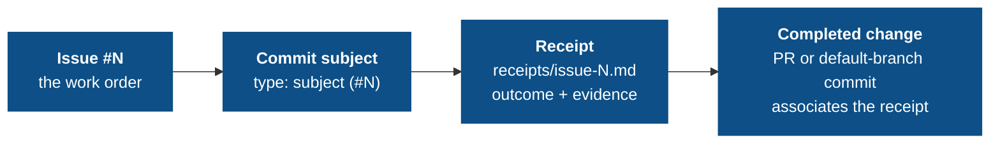

# The audit chain

If you trust agents to ship code, you need to see what they did against each issue. The audit chain turns that into mechanical directives over git-native, tamper-evident artifacts without retaining chat history or harness-private state.

## The chain



Every link is enforced by a directive in the `governance-kit/audit` pack (the `standard` preset); breaking any link fails the next push:

| Link | Directive | What it enforces |
|---|---|---|
| Every commit names the issue | `commit-message-format` | Conventional Commits subject with a trailing `(#N)` |
| Work attests itself | `receipt-per-issue` | Unique receipt per issue; a completed change is associated with it and records outcome + verification evidence |
| The record can't be rewritten | `doc-integrity` | Receipts freeze once on the trunk; the Evolution Log keeps baseline lines verbatim |

Everything homes in the receipt. There are **no usage, cost, or steering rows and no kit-owned session trailers**. Harnesses that stamp their own session on the commit (Claude Code's `Claude-Session:`, and equivalents) are outside this pack.

## Receipts: attestation over promise

A plan says what the model *intends*; a receipt says what it *did*, in a form a reviewer can check. One receipt per issue, at `receipts/issue-<N>.md` (optional kebab-case slug), completed at the PR or direct-to-default boundary:

```markdown
## What changed     # outcome and significant behavior, with the work-item reference
## Verification     # commands/checks and their outcomes, or a durable evidence URL
## Decisions        # optional — only when a tradeoff, deviation, or limitation exists
## Audit            # independent review of outcome + evidence against the diff and issue
```

A fenced command with no outcome is not evidence, and a recorded fence or verdict is not proof that a command ran. Historical session-only or accounting-only stubs cannot satisfy a completed change.

`receipt-per-issue` also ties the **completed change** to a receipt, file-first: the aggregate PR diff (or the direct-to-default commit) must add or modify at least one `receipts/issue-<N>.md`. Intermediate feature-branch commits do not each need a receipt edit. The path sits in the aggregate diff identically before and after a squash-merge. (The subject's own `(#N)` is still required, separately, by `commit-message-format`.)

## doc-integrity: the record cannot be quietly rewritten

An audit trail you can edit is not an audit trail. `doc-integrity` makes system-of-record documents tamper-evident, driven by the manifest's tunable `RULES` list with three rule shapes:

| Rule | Semantics |
|---|---|
| `frozen-files <glob>` | Once a matching file is on the trunk, it is immutable. New files are fine. (Receipts and sealed legacy ledgers.) |
| `append-only <file>` | The trunk version must remain a byte-prefix of the current version. |
| `frozen-section <file> <heading>` | Lines under the heading survive verbatim; the rest of the file is free. (`QUALITY.md` Resolved, the Evolution Log.) |

Everything is measured against the *trunk baseline* — branch-authored content stays editable until it merges, then freezes. Once a receipt lands on the trunk, its outcome and evidence cannot be rewritten. Exceptions are path-scoped waivers in the commit body.

## Reading the record

The payoff is that oversight becomes *reading*, not *re-deriving*:

- `git log` answers "which issue did this commit belong to?" via the trailing `(#N)`.
- `receipts/` answers "what exactly landed for issue #N, and how was it verified?"

Next: [Limitations](/concepts/limitations) — the honest edges of what the commit path can enforce.
