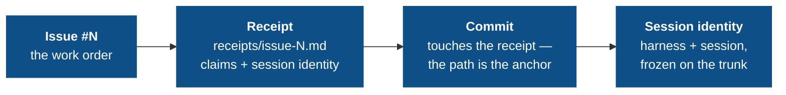

# The audit chain

If you trust agents to ship code, you need to see what they did against each issue and which run authored the change. The audit chain turns that into mechanical directives over git-native, tamper-evident artifacts without retaining chat history or harness-private state.

## The chain



Every link is enforced by a directive in the `governance-kit/audit` pack (the `standard` preset); breaking any link fails the next push:

| Link | Directive | What it enforces |
|---|---|---|
| Issues exist & are structured | `issue-templates`, `issues-tracked` | Issue forms with handoff fields; a `QUALITY.md` board with `## Open` / `## Resolved` |
| Work attests itself | `receipt-per-issue` | One receipt file per issue with the required sections and a crosswalked checklist |
| Commits anchor to work | `commit-issue-receipt-match` | Every non-merge commit touches its issue's `receipts/issue-<N>.md` — the receipt path **is** the anchor |
| Session provenance is explicit | `agent-session-identity` | Each recognized agent runtime adds one `date | harness | session` row under `## Session` → `### Identifiers`; identity comes only from explicit signals |
| The record can't be rewritten | `doc-integrity` | Receipts freeze once on the trunk; frozen sections keep their baseline lines verbatim |

Everything homes in the receipt. There are **no usage, cost, or steering rows and no accounting commit trailers**. The session row lives only in `receipts/issue-<N>.md`, which `doc-integrity` freezes on the trunk.

## Receipts: attestation over promise

A plan says what the model *intends*; a receipt says what it *did*, in a form a reviewer can check. One receipt per issue, at `receipts/issue-<N>-<slug>.md`, with four required sections — plus an optional `## Session` section for agent provenance:

```markdown
## Checklist        # mirrors the GitHub issue's acceptance items
## What changed     # the actual changes, by file/behavior
## Out of scope     # explicitly not done
## Verification     # how each claim was checked
## Session          # ### Identifiers: date | harness | session
```

The trust boundary: **every `- [x]` checklist item must crosswalk** — its text must appear in `## What changed` or `## Verification`. An agent cannot flip a box without writing down what it did and how that was verified. The receipt is what a reviewer reads instead of the raw diff.

`commit-issue-receipt-match` ties commits to receipts the other direction, and it does it **file-first**: every non-merge, non-revert commit must add or modify at least one `receipts/issue-<N>.md`, and the touched receipt's filename *is* the issue anchor. That path sits in the diff identically before and after a squash-merge — where the subject flips to the PR number — so the link survives the squash with no body trailer to recover it. (The subject's own `(#N)` is still required, separately, by `commit-message-format`.)

## Session identity: provenance without surveillance

`agent-session-identity` records one row for each recognized runtime/session
pair that authored the change, under `## Session` → `### Identifiers`:

```
| date | harness | session |
```

The hook reads only explicit environment signals or a fresh kit-owned identity
sidecar. It never opens a transcript, session database, usage file, or
harness-private path. Human commits are a no-op; a runtime that cannot name its
session records `-` rather than guessing.

The directive is `always_install: true` because provenance is useful even when
the rest of the audit chain is selected minimally. It records an identifier,
not conversation contents or operator intent, so the receipt remains suitable
for public repositories.

## doc-integrity: the record cannot be quietly rewritten

An audit trail you can edit is not an audit trail. `doc-integrity` makes system-of-record documents tamper-evident, driven by the manifest's tunable `RULES` list with three rule shapes:

| Rule | Semantics |
|---|---|
| `frozen-files <glob>` | Once a matching file is on the trunk, it is immutable. New files are fine. (Receipts — including their session identity rows — and sealed legacy ledgers.) |
| `append-only <file>` | The trunk version must remain a byte-prefix of the current version. |
| `frozen-section <file> <heading>` | Lines under the heading survive verbatim; the rest of the file is free. (`QUALITY.md` Resolved, the Evolution Log.) |

Everything is measured against the *trunk baseline* — branch-authored content stays editable until it merges, then freezes. This is the directive that makes receipt-homed provenance trustworthy: once a receipt lands on the trunk, its session identity cannot be rewritten. Exceptions are path-scoped waivers in the commit body.

## Reading the record

The payoff is that oversight becomes *reading*, not *re-deriving*:

- A receipt's `### Identifiers` row answers "which run authored this issue?" with grep.
- `receipts/` answers "what exactly landed for issue #N, and how was it verified?"

Next: [Limitations](/concepts/limitations) — the honest edges of what the commit path and session provenance can enforce.
