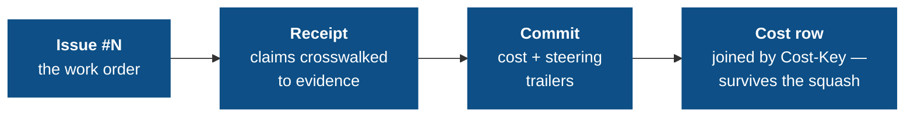

# The audit chain

If you trust agents to ship code, you need to see what they were told, what they did against each issue, what it cost, and how often you had to grab the wheel. The audit chain turns that into mechanical directives over git-native, tamper-evident artifacts.

## The chain



Every link is enforced by a directive in the `governance-kit/audit` pack (the `standard` preset); breaking any link fails the next push:

| Link | Directive | What it enforces |
|---|---|---|
| Issues exist & are structured | `issue-templates`, `issues-tracked` | Issue forms with handoff fields; a `QUALITY.md` board with `## Open` / `## Resolved` |
| Work attests itself | `receipt-per-issue` | One receipt file per issue with the required sections and a crosswalked checklist |
| Commits anchor to work | `commit-issue-receipt-match` | Every commit's `(#N)` anchor matches a receipt it touches |
| Work carries its price | `agent-token-accounting` | Token + cost trailers on every commit, matching a cost row in the issue's receipt |
| Steering is visible | `agent-steering-accounting` | `Steer-*` trailers tallying steering rows in the issue's receipt |
| The record can't be rewritten | `doc-integrity` | Receipts freeze once on the trunk; frozen sections keep their baseline lines verbatim |

## Receipts: attestation over promise

A plan says what the model *intends*; a receipt says what it *did*, in a form a reviewer can check. One receipt per issue, at `receipts/issue-<N>-<slug>.md`, with four required sections — plus an `## Accounting` section that carries the issue's cost and steering rows:

```markdown
## Checklist        # mirrors the GitHub issue's acceptance items
## What changed     # the actual changes, by file/behavior
## Out of scope     # explicitly not done
## Verification     # how each claim was checked
## Accounting       # ### Costs and ### Steering rows, appended per commit
```

The trust boundary: **every `- [x]` checklist item must crosswalk** — its text must appear in `## What changed` or `## Verification`. An agent cannot flip a box without writing down what it did and how that was verified. The receipt is what a reviewer reads instead of the raw diff.

`commit-issue-receipt-match` then ties commits to receipts: each non-merge commit needs an issue anchor (`(#N)` in the subject or `Issue: #N` trailer) matching an `issue-<N>` token on a receipt the commit touches.

## Cost accounting: every change has a price tag

`agent-token-accounting` requires the token/cost trailers on every non-merge commit:

```
Agent: claude-code
Issue: #123
Session: 01HXYZ…
Token-Input: 1200
Token-Output: 450
Token-Total: 1650
Cost-Key: claude-01HXYZab-1713800000
Cost-USD: 2.7932
```

…and a matching row under `### Costs` in the issue's receipt:

```
| cost-key | agent | session | issue | model | input | cache-create | cache-read | output | new-work | cost-usd | note |
```

The layering is the interesting part. Naive anchors all break: PR-level accounting is too late, commit SHAs disappear under squash-merge, transcripts are ephemeral. So:

- **Trailers** carry branch-time provenance on the commit itself.
- **The receipt row** is the durable record.
- **`Cost-Key`** is the stable join key present in both — it survives the squash because it lives in the message body and the receipt, not in a SHA.
- The directive cross-checks trailer ↔ receipt on every commit.

Token columns distinguish *new work* from cache traffic (`new-work = input + cache-create + output`; cache reads are excluded), and `Cost-USD` is computed from the runtime-reported model via a rates table — real dollars, not vibes.

The trailers are *stamped* by the directive's own `prepare-commit-msg` populator (reading the runtime's usage data) and *verified* by its check — write and read paths kept separate.

## Steering accounting: where the human grabbed the wheel

`agent-steering-accounting` records **human steering events** — interrupts and corrections — as rows under `### Steering` in the issue's receipt:

```
| steer-key | session | issue | type | tier | user-reason | commit |
```

Every commit carries a summary triple, even when nothing happened (always-on, so silence is unambiguous):

```
Steer-Count: 2
Steer-Types: correction=1,interrupt=1
Steer-Tiers: classifier=1,structural=1
```

Detection is two-tier: **structural** (runtime interrupt sentinels — near-zero false positives) and **semantic** (user messages after assistant turns, classified as corrections by the runtime's headless CLI, with a regex fallback). The point is rule-layer steering: where humans repeatedly steer is the signal for which directives are missing or misaligned. You can read, per commit, which changes ran on autopilot and which needed your hand on the wheel.

<Note>
This directive (and `doc-integrity`) is `always_install: true` — the audit model depends on it unconditionally. It records correction text verbatim; redact via its classifier hook rather than switching it off.
</Note>

## doc-integrity: the record cannot be quietly rewritten

An audit trail you can edit is not an audit trail. `doc-integrity` makes the system-of-record documents tamper-evident, driven by standard rules in its `defaults.conf` (layered with the `.governance/conf/governance-kit/audit/doc-integrity.conf` overlay) with three rule shapes:

| Rule | Semantics |
|---|---|
| `frozen-files <glob>` | Once a matching file is on the trunk, it is immutable. New files are fine. (Receipts — which now carry the accounting rows — and the sealed legacy `COSTS.md` / `STEERING.md` ledgers.) |
| `append-only <file>` | The trunk version must remain a byte-prefix of the current version. |
| `frozen-section <file> <heading>` | Lines under the heading survive verbatim; the rest of the file is free. (`QUALITY.md` Resolved, the Evolution Log.) |

Everything is measured against the *trunk baseline* — branch-authored content stays editable until it merges, then freezes. Exceptions are path-scoped waivers in the commit body.

## Reading the record

The payoff is that oversight becomes *reading*, not *re-deriving*:

- `git log` headlines show cost and steering at a glance (`Token-Total`, `Cost-USD`, `Steer-Count`).
- A receipt's `### Costs` rows answer "what did this issue cost?" with grep.
- Its `### Steering` rows answer "where do agents go off the rails?" — input for the next directive.
- `receipts/` answers "what exactly landed for issue #N, and how was it verified?"

Next: [Limitations](/concepts/limitations) — the honest edges of what the commit path and the accounting can enforce.
