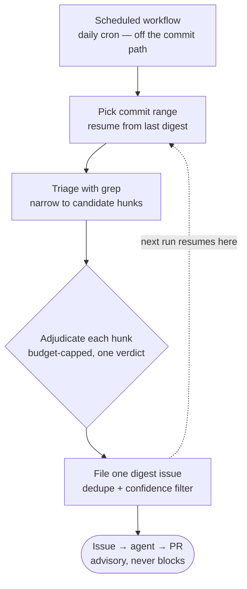

# The sweep lane

Greppability is a directive's enforcement ceiling. A `check.sh` is bash + `git grep` — perfect for *syntactic* invariants (forbidden imports, banned identifiers, file-shape rules), useless for the *semantic* ones about **intent and architectural shape**: "remove the legacy fallback", "don't bifurcate the code path", "local must mirror remote". Those are exactly the corrections humans keep making to agent-authored code.

The **sweep** surface is a third enforcement lane for those invariants — one that **never touches the commit path**.



## Why off the commit path

A false positive on the commit path is catastrophic: one wrong block → `--no-verify` → *every* directive, including the solid greps, is bypassed. Put the judge on a schedule instead and that failure mode dissolves rather than needing to be solved — a noisy verdict costs a triage, not the gate's authority. Determinism and latency relax from hard requirements to hygiene.

This mirrors the harness-engineering split: mechanical linters enforce structure synchronously; background tasks scan for semantic deviations on a schedule and open targeted work items. There is **no blocking path at all** — promoting a sweep directive to a gate is a separate future decision, contingent on the directive's digest-precision history.

Findings re-enter the repo through the same door as a human correction: **issue → agent → PR**.

## The directive contract

A sweep directive is the same self-contained folder as any other, with three differences. `surface: sweep` is what `run.sh` and the hook generator key off to ignore it entirely — it is invisible to pre-commit and the PR governance job by construction:

```yaml
category: ArchitecturalShape
surface: sweep          # the third surface, alongside repo-state | change-set
hook: none
engine: llm
model_tier: high        # a capability tier, not a model id
summary: "No backward-compat shims or legacy fallback paths."
```

The folder carries:

- **`triage.sh`** instead of `check.sh` — a cheap grep pre-filter. The engine sets a git range; the script prints `path:line` candidate locations. Empty output costs zero inference requests. Triage is never the verdict: over-inclusion is fine (the judge rejects false smoke); under-inclusion is the real risk, so patterns stay broad.
- **`constitution.md`** — the Directive + Rationale already authored for humans doubles as the judge's rubric. No new authoring format.
- **`evals/violating/` + `evals/clean/`** — calibration fixtures, plus an eval that runs the real judge against them with a precision/recall floor. No eval, no ship.

## The engine

A kit-owned, stdlib-only engine (vendored as `.governance/sweep.py`) does the work in a plain cron with nothing but system Python:

- **Range** — commits since the last sweep. State lives in the previous digest issue (an HTML-comment marker records the end SHA), so there is no committed state file. First runs fall back to a time window.
- **Triage** — each sweep directive's `triage.sh` over the range, narrowing a day of commits to candidate hunks.
- **Adjudication** — each hunk gets one structured verdict (`pass`, violations with file/line/quote/why, confidence) under a request budget. In CI and tests, a deterministic echo stub stands in for the model.
- **Digest** — one issue per run, deduplicated and confidence-filtered, never one issue per finding.

## Guardrails

- **Advisory until proven.** A sweep directive stays advisory until its digest precision earns a promotion — and promotion is a deliberate decision, not a default.
- **Tier, not model id.** Directives pin a capability *tier*; an upgrade within a tier can't silently rewrite verdicts.
- **Budget-capped.** Each run adjudicates under an explicit request budget; triage keeps the candidate set small enough that the budget means something.

## What ships today

The opt-in `governance-kit/architecture` pack (the `strict` preset) carries the pilot directives:

| Directive | What it watches for |
|---|---|
| `no-legacy-fallbacks` | Backward-compat shims and legacy fallback paths in agent-authored changes. |
| `no-path-bifurcation` | Bifurcated code paths — dual dispatch, local-vs-remote special-casing. |

Enabling the pack also installs the scheduled workflow and the vendored engine.

Next: [Versioning & releases](/concepts/versioning) — how the kit and the packs evolve without breaking the repos that pin them.
