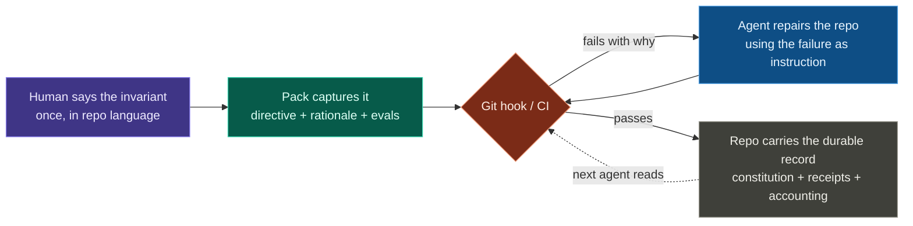
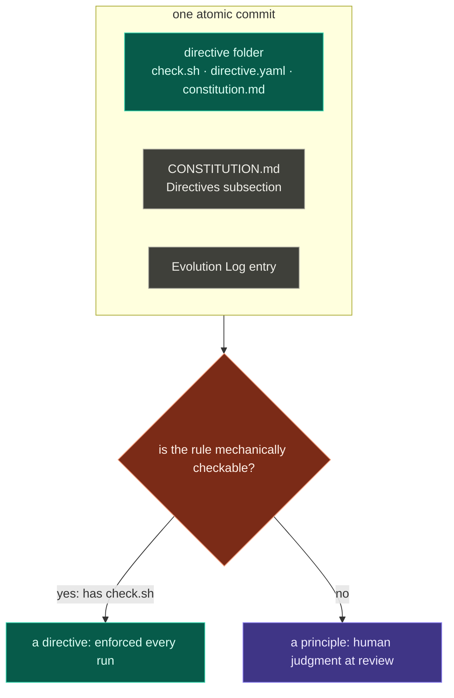
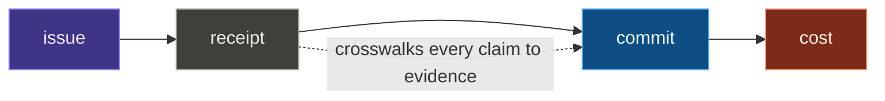

# Mental models

Four ideas carry the whole kit. Understand these and the rest of the documentation is detail. They apply the [harness-engineering](https://openai.com/index/harness-engineering/) principle that coherence comes from executable rails around the agent, not ever-larger instruction blobs.

## 1. The repo is a reconciliation loop

The model Kubernetes and Terraform use, applied to a repository: declare the desired state, let checks close the gap.



Every directive is an **invariant on state**, not a step in a procedure, so there is no dependency graph and no ordering. `run.sh` evaluates every check alphabetically, every time; convergence follows from re-evaluation. The agent is the reconciler: a failed check names the gap and its rationale, then the agent fixes the repo and re-runs until reality matches the declaration.

<Tip>
Don't chain actions; describe state and let re-evaluation converge.
</Tip>

## 2. Rule and test are one artifact

> If a rule is not executable, it is a wish.

This is the cardinal rule. Every directive ships with the `check.sh` that enforces it, and an amendment lands as one **atomic commit**. This prevents drift between the stated rule and the repo's enforcement.



The `directive {add,modify,remove}` verbs make that triple mechanical. Things that *can't* be mechanically checked are principles, not directives: they live in the constitution too, but their gate is human review. The kit is honest about that boundary.

## 3. Steer at the rule layer, not the turn layer

Per-turn prompting does not compose: the next agent on the next branch cannot read your last conversation. A directive reaches every future agent without you being in the room. Write it once; enforce it on every run.

<Frame caption="A per-turn correction dies with the session; a directive in CONSTITUTION.md reaches every future agent. Redirects that do not become directives are captured as steering rows in the receipt.">
  
  
</Frame>

Repeated human steering shows which rules are missing or misaligned. The rules should evolve with that signal.

## 4. Receipts beat plans; ledgers outlive sessions

Pre-implementation plans are the model's *promise* and get thrown away; post-implementation receipts are its durable *attestation*. The system of record is a set of **tracked, tamper-evident files**, including `CONSTITUTION.md`, `QUALITY.md`, and `receipts/`, rather than chat history or session transcripts. The [audit chain](/concepts/audit-chain) wires them into one crosswalk, and breaking any link fails the next push.



These survive the squash merge, the runtime swap, and the team turnover.

## The mechanics that follow

The four models set the stance; the rest of the kit is how it's enforced.

| Mechanic | In one line |
|---|---|
| **Verify, don't trust** | The agent is a moderately-untrusted author; the kit makes CI-grade verification cheap enough to apply at agent throughput. Pack code is pinned by SHA and vendored, so the gating checks are reviewable in your own diffs. |
| **Plan / apply** | Every lifecycle verb (`init`, `uninstall`, `reset`, `kit update`, `pack *`) shows the exact per-file diff before it runs: applies land fully or roll back, verbs are idempotent, and no verb touches the network at commit time. |
| **Exceptions are data** | A `# governance: allow-<directive-id> <reason>` waiver is an auditable exception visible in `git blame`. A silent `SKIP_GOVERNANCE` / `--no-verify` bypass never survives CI. |
| **Versioned in layers** | Installer, product, and content version independently; the *repo* pins each via `install.yaml` + `packs.lock`. See [Versioning & releases](/concepts/versioning). |

## The vocabulary

| Term | Meaning |
|---|---|
| **Directive** | A concrete, mechanically-checkable requirement. Only belongs in `CONSTITUTION.md` if an executable test exists. |
| **Principle** | A non-mechanical guideline; enforcement is human judgment at review. |
| **Waiver** | A documented, in-source exception to a directive. |
| **Pack** | A versioned bundle of directives, installed and pinned as a unit. |
| **Preset** | A named directive selection a pack declares (`minimal` / `standard` / `strict`). |
| **Evolution Log** | Append-only history in `CONSTITUTION.md` recording every governance change with date and author. |
| **Receipt** | Per-issue attestation under `receipts/`, crosswalking claims to evidence and carrying the issue's cost and steering accounting. |
| **Drift** | Misalignment between things that should agree: constitution vs. test, doc vs. code, lockfile vs. tree. |
| **System of record** | The tracked files that define how the repo works *now*. |

## Where these ideas live in the tree

```
your-repo/
├── CONSTITUTION.md              # desired state: directives + rationale + evolution log
├── AGENTS.md                    # entry point; carries the "follow the constitution" block
├── QUALITY.md  receipts/        # the quality board + per-issue receipts (incl. accounting)
├── .governance/
│   ├── run.sh  lib.sh           # the runner (kit-owned, version-stamped)
│   ├── install.yaml             # init choices + side-effect receipt; pins the kit
│   ├── packs.lock               # pack pin state (id, version, source, sha)
│   ├── conf/<owner>/<pack>/<id>.conf               # user-owned config overlays
│   └── packs/<owner>/<name>/directives/<id>/       # vendored check code
├── .githooks/                   # generated hook dispatchers (or .husky/, …)
└── .github/workflows/governance.yml                # CI re-enforcement
```

Next: [The constitution & directives](/concepts/constitution): how a directive is built, installed, and enforced.
