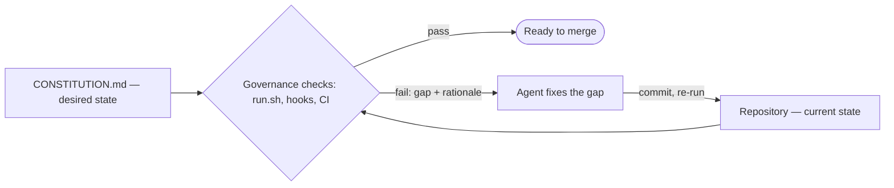

# Mental models

Everything in Governance Kit follows from a handful of ideas. Get these and the rest of the docs are detail. They all serve one stance: coherence comes from executable rails around the agent, not ever-larger instruction blobs — the [harness-engineering](https://openai.com/index/harness-engineering/) move.

## 1. The repo is a reconciliation loop

The core model is the one Kubernetes and Terraform use, applied to a repository:

- **Desired state** is declared in `CONSTITUTION.md` — directives with rationale.
- **Current state** is reality: the working tree, the staged diff, the pending commit message, the receipts.
- **Checks** compare the two. Every directive is an *invariant on state*, not a step in a procedure.
- **The agent is the reconciler.** A failed check names the gap and the why; the agent fixes the repo and re-runs until reality matches the declaration.



Because directives are invariants, there is **no dependency graph and no ordering**. `run.sh` evaluates every check alphabetically, every time. When directive B logically depends on directive A's postcondition, B checks the precondition itself and skips-with-info if it isn't met. Convergence falls out of re-evaluation: fix what's currently violating, re-run, the next gate fires, fix that, re-run, done.

<Tip>
Don't chain actions; describe state and let re-evaluation converge.
</Tip>

## 2. An installer, a product, its content

Governance Kit is three layers, and the analogy to a language toolchain manager carries almost all the way:

<Frame caption="The governance skill installs the kit, the kit consumes packs, and the repo pins every version — a language-toolchain manager (rustup · toolchain · lockfile) for governance.">
  
  
</Frame>

The skill is a two-file shim that fetches and honors pins; the kit is the versioned product every verb executes from; packs are the directive content the kit consumes. Each layer versions independently, and the *repo* — not the installer — decides which versions it runs. See [Versioning & releases](/concepts/versioning).

## 3. The cardinal rule: rule and test are one artifact

> If a rule is not executable, it is not a rule — it is a wish.

Every directive in `CONSTITUTION.md` has a matching `check.sh`, and **amendments to the constitution land in the same commit as the change to the enforcing test**. No exceptions. This is the cardinal rule, and the `directive {add,modify,remove}` verbs exist to make it mechanical: each amendment is an *atomic triple* —

1. the directive folder (`check.sh` + `directive.yaml` + `constitution.md`),
2. the Directives subsection in `CONSTITUTION.md`,
3. an Evolution Log entry,

— committed together. There is no drift between "what we said the rule is" and "what the repo actually enforces," because they are the same artifact.

A corollary: things that *can't* be mechanically checked are **principles**, not directives. They live in the constitution too, but their enforcement gate is human judgment at PR review. The kit is honest about that boundary.

## 4. Steer at the rule layer, not the turn layer

Per-turn prompting does not compose. The next agent on the next branch cannot read your last conversation. A directive in `CONSTITUTION.md` reaches every future agent without you being in the room — **once-authored, infinitely-enforced**.

The redirects you *don't* promote into directives aren't lost either: every human interrupt and correction is recorded as a steering row in the issue's receipt, per commit. Where humans repeatedly steer is the signal for which rules are missing or misaligned — the rules themselves evolve, not just the prompts.

## 5. Receipts beat plans; ledgers outlive sessions

Pre-implementation plans are the model's *promise*; post-implementation receipts are its *attestation*. Plans are private to the runtime and get thrown away. Receipts are durable, reviewable, and crosswalk every claim ("I did X") to evidence (where X is verifiable in the diff or the verification steps).

The system of record is a set of **tracked, tamper-evident files in the repo** — `CONSTITUTION.md`, `QUALITY.md`, `receipts/` (each receipt carrying its issue's cost and steering accounting) — not chat history, not session transcripts, not runtime-local state. They survive the squash merge, the runtime swap, and the team turnover. The [audit chain](/concepts/audit-chain) wires them together: **issue → receipt → commit → cost**, and breaking any link fails the next push.

## 6. Verify, don't trust — and make verification cheap

The agent is treated as a moderately untrusted author whose work crosswalks back to an issue, evidence, and cost. This is not pessimism about agents; it is the posture mature teams already take with humans (CI, review, audit trails). GDD's job is to make that posture *cheap enough to apply at agent throughput*, because human review bandwidth does not scale with agent commit volume.

The same posture applies to the kit's own supply chain: pack code is **pinned by SHA and vendored into your tree**, so the check code that gates your commits is reviewable in your own diffs ([Packs, pins & vendoring](/concepts/packs)).

## 7. Plan / apply, diff-before-exec

Every lifecycle verb (`init`, `uninstall`, `reset`, `kit update`, `pack *`) is split into a deterministic **plan** step and an **apply** step:

- The *operator* (your agent, following the skill) owns elicitation — questions, choices, collision resolutions.
- A *mechanical engine* (`packverb` / `kitverb`) validates decisions, emits a plan with per-file diffs, and executes the apply in one tested call.

Nothing destructive runs without showing you the exact diff first, and applies either land fully or roll back. Verbs are idempotent — running them against an already-converged repo is a successful no-op. And **no verb touches the network at commit time**: all fetching happens inside user-invoked verbs, never in hooks.

## 8. Exceptions are data, not bypasses

Real repos need exceptions. Governance Kit's answer is the **waiver** — an in-source comment that names the directive and the reason:

```
# governance: allow-<directive-id> <reason>
```

Waivers are intentional, local, and visible in `git blame` — an auditable record of every place the rule was consciously relaxed. Contrast with `SKIP_GOVERNANCE=1` / `--no-verify`, which exist for local hotfixes but don't survive CI: every directive re-runs on every PR.

## The vocabulary

| Term | Meaning |
|---|---|
| **Directive** | A concrete, mechanically-checkable requirement. Only belongs in `CONSTITUTION.md` if an executable test exists. |
| **Principle** | A non-mechanical guideline; enforcement is human judgment at review. |
| **Waiver** | A documented, in-source exception to a directive. |
| **Pack** | A versioned bundle of directives, installed and pinned as a unit. |
| **Preset** | A named directive selection a pack declares (`minimal` / `standard` / `strict`). |
| **Evolution Log** | Append-only history in `CONSTITUTION.md` recording every governance change with date and author. |
| **Receipt** | Per-issue attestation file under `receipts/`, crosswalking claims to evidence and carrying the issue's cost and steering accounting. |
| **Drift** | Misalignment between things that should agree — constitution vs. test, doc vs. code, lockfile vs. tree. |
| **System of record** | The tracked files that define how the repo works *now*. |

## Where these ideas live in the tree

```
your-repo/
├── CONSTITUTION.md              # desired state: directives + rationale + evolution log
├── AGENTS.md                    # entry point; carries the "follow the constitution" block
├── QUALITY.md  receipts/        # the quality board + per-issue receipts (incl. accounting)
├── .governance/
│   ├── run.sh  lib.sh           # the runner (kit-owned, version-stamped)
│   ├── install.yaml             # init choices + side-effect receipt; pins the kit
│   ├── packs.lock               # pack pin state (id, version, source, sha)
│   ├── conf/<owner>/<pack>/<id>.conf               # user-owned config overlays
│   └── packs/<owner>/<name>/directives/<id>/       # vendored check code
├── .githooks/                   # generated hook dispatchers (or .husky/, …)
└── .github/workflows/governance.yml                # CI re-enforcement
```

Next: [The constitution & directives](/concepts/constitution) — how a directive is built, installed, and enforced.
