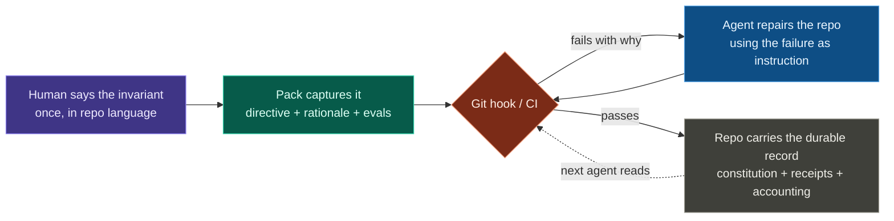

# Governance Kit

> **The governance layer for AI coding agents: give every agent the same repo memory.**

Coding agents often finish the task in a way that's locally fine and globally wrong: a feature landed through the wrong layer, a pattern you retired quietly revived, a boundary you wanted held quietly widened. The objective passes; the repo drifts. The next agent has no memory of the correction you made last time, so you make it again.

Governance Kit turns those repeated corrections into repo-native invariants. Your rules live in a versioned `CONSTITUTION.md`, every rule ships with an executable test, and agents do the work of keeping the repo compliant. The correction you make once reaches the next agent, on the next branch, without you re-teaching it. It installs as an [Agent Skill](https://agentskills.io) into Claude Code, Codex, Cursor, and 40+ skills-compatible runtimes. One skill provides one entry point: the `governance` verb surface.

<Columns cols={3}>
  <Card title="Quickstart" href="/guide/quickstart" icon="rocket">
    Install the skill, bootstrap a repo, and watch a gate fire in about 60 seconds.
  </Card>
  <Card title="What is Governance Kit?" href="/guide/introduction" icon="circle-help">
    The problem it solves and the stance behind it.
  </Card>
  <Card title="Mental models" href="/guide/mental-models" icon="brain">
    The handful of ideas everything else is built on.
  </Card>
</Columns>

## How does it work?

> Describe the state, continuously check reality, and let agents reconcile the difference.

A human states the invariant once, in repo language. A pack captures it as a directive plus its rationale and test. The gate explains *why* it failed, the agent repairs the repo, and the repo keeps a durable record for the next agent. This applies the [harness-engineering](https://openai.com/index/harness-engineering/) principle that coherence comes from executable rails around the agent, not ever-larger instruction blobs.

A failed check is a *gap report*. It names the directive, the offending file and line, and the rationale. A capable agent can use that rationale to handle cases the rule's author never encoded. The design applies the Kubernetes/Terraform reconciliation model to a repo, as explained in [mental models](/guide/mental-models). See [What is Governance Kit?](/guide/introduction) for why this matters when agents author most changes.

## Explore the docs

<Columns cols={2}>
  <Card title="Get started" href="/guide/quickstart" icon="rocket">
    Install, bootstrap, and learn the mental models. Start here on your first visit.
  </Card>
  <Card title="Concepts" href="/concepts/constitution" icon="book-open">
    How the constitution, packs, runtime, and audit chain work.
  </Card>
  <Card title="Guides" href="/guide/configuration" icon="wrench">
    Configure the kit, integrate native test runners, and author your own packs.
  </Card>
  <Card title="Reference" href="/reference/verbs" icon="list-checks">
    Every verb, every bundled directive, and the file schemas.
  </Card>
</Columns>
