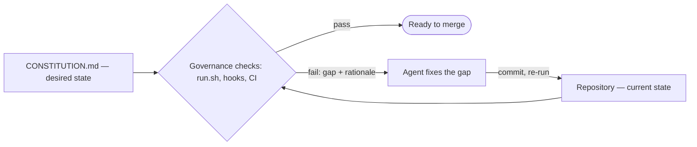

# Governance Kit

> **The governance layer for AI coding agents.**

Your repository's rules live in a versioned `CONSTITUTION.md`, every rule ships with an executable test, and agents — not humans — do the work of keeping the repo compliant. It installs as an [Agent Skill](https://agentskills.io) into Claude Code, Codex, Cursor, and 40+ skills-compatible runtimes — one skill, one entry point: the `governance` verb surface.

<Columns cols={3}>
  <Card title="Quickstart" href="/guide/quickstart" icon="rocket">
    Install the skill, bootstrap a repo, watch a gate fire — about 60 seconds.
  </Card>
  <Card title="What is Governance Kit?" href="/guide/introduction" icon="circle-help">
    The problem it solves and the stance behind it.
  </Card>
  <Card title="Mental models" href="/guide/mental-models" icon="brain">
    The handful of ideas everything else is built on.
  </Card>
</Columns>

## How it works

> Describe the state, continuously check reality, and let agents reconcile the difference.

This is declarative reconciliation — the Kubernetes/Terraform model — applied to a repository:

A failed check is not a scolding; it is a *gap report*. It names the directive, the offending file and line, and the rationale — and a frontier-model agent reading that rationale generalizes to cases the rule's author never encoded. Why this matters when agents author most of the changes: [What is Governance Kit?](/guide/introduction)

## Explore the docs

<Columns cols={2}>
  <Card title="Get started" href="/guide/quickstart" icon="rocket">
    Install, bootstrap, and learn the mental models. Start here on your first visit.
  </Card>
  <Card title="Concepts" href="/concepts/constitution" icon="book-open">
    How it works under the hood — the constitution, packs, the runtime, and the audit chain.
  </Card>
  <Card title="Guides" href="/guide/configuration" icon="wrench">
    Operate, integrate, and extend — configuration, native test runners, and authoring your own packs.
  </Card>
  <Card title="Reference" href="/reference/verbs" icon="list-checks">
    Every verb, every bundled directive, and the file schemas.
  </Card>
</Columns>
